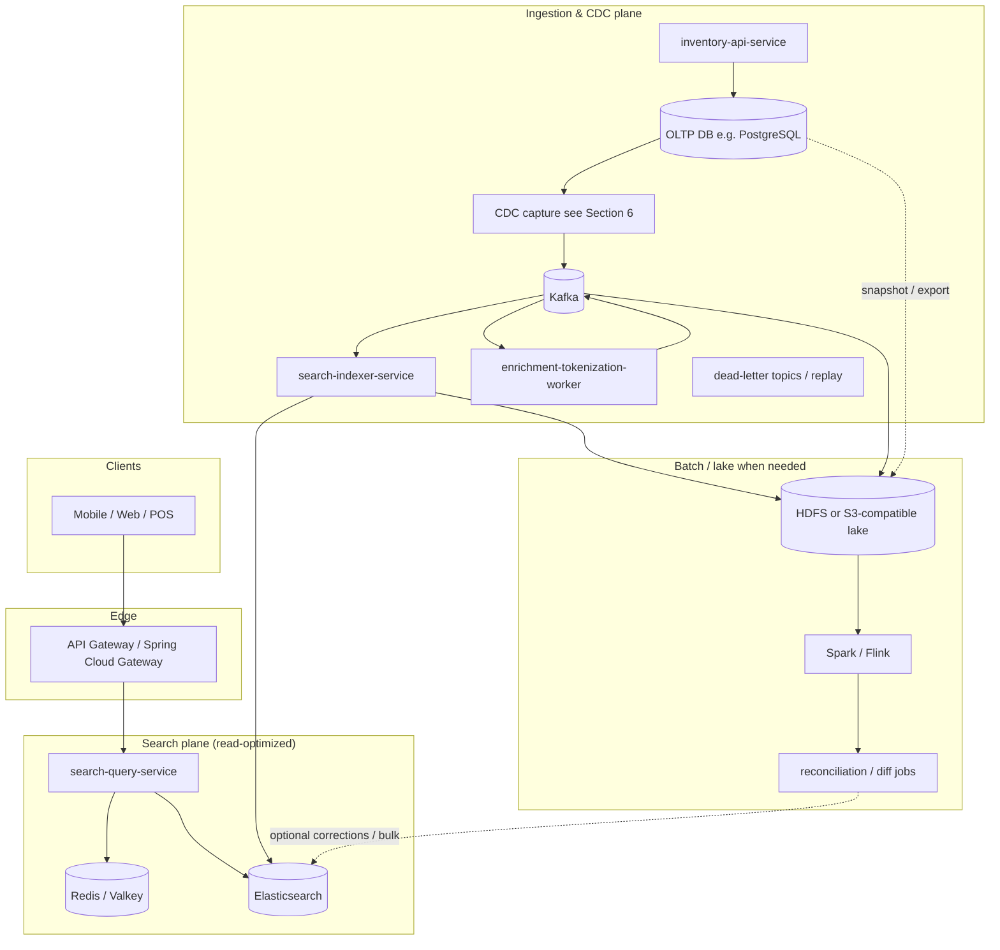
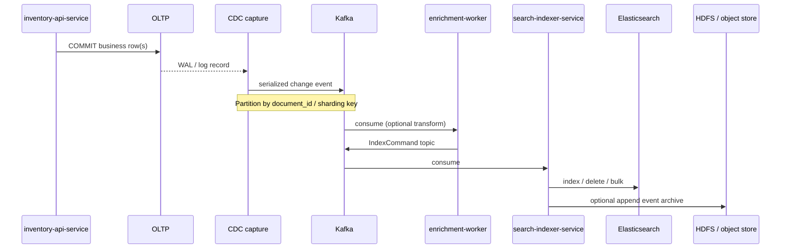

# Grocery Item Search — Architecture & Delivery Plan

This document describes a **planned** software stack and data flows for a **natural-language and recipe-oriented search** feature over retail grocery inventory (name, description, department, and related attributes). It is written from **lead architect** and **lead engineer** perspectives: goals, boundaries, services, **CDC in depth**, **index refresh in depth**, Hadoop-backed batch and reconciliation, latency expectations, libraries, industry patterns, long-term risks, and a phased rollout. **Implementation is intentionally deferred** until stakeholders review and align on scope.

---

## 1. Objectives

| Goal | Detail |
|------|--------|
| **NL + recipe queries** | Users phrase intent in natural language (“dinner for two under $20”, “ingredients for carbonara”, “gluten-free pasta aisle 3”). Retrieval combines **tokenized full-text search**, **structured filters** (department, store, availability), and optional **query understanding** (synonyms, ingredient expansion). |
| **Tokenization-first** | Similar in spirit to large-scale search: **analyze** queries and documents consistently (normalization, stemming/lemmatization where appropriate, stopwords, language-aware tokenizers), build **inverted indexes**, score with **BM25** (or learned rank later). Elasticsearch provides this out of the box; custom **synonym / entity** layers sit beside it. |
| **Real time** | Inventory changes should become **search-visible within seconds** under normal load (tunable vs. cost). |
| **Scale** | Design for **millions of concurrent end users** (read-heavy): horizontally scaled stateless APIs, Elasticsearch cluster, Kafka, caches, and optional regional replication. |
| **Ease of updates** | **CDC-driven** incremental index updates; **bulk** paths for cold start and disaster rebuild; clear separation of **source of truth** (OLTP) vs. **search index**. |
| **Hadoop when the problem needs it** | Use **HDFS (or cloud object store with Hadoop-compatible APIs)** and **Spark/Flink** for **large-scale snapshotting, reconciliation, feature generation, and full rebuilds**—not as decoration, but wherever volume, audit, or ML pipelines exceed what streaming microservices alone should carry. |

**Non-goals (initial phase):** Replacing the inventory OLTP database; building a general-purpose web crawler; full semantic/vector-only search (can be phase 2+).

---

## 2. High-Level Architecture (Microservices, Spring, Java 21)



**Service responsibilities (concise):**

| Service | Role |
|---------|------|
| **inventory-api-service** | CRUD and transactional inventory; owns validation and business rules; writes only to OLTP. |
| **search-query-service** | Stateless query API: parse request → optional query rewriting → ES query DSL → merge filters → rank → cache keying; no direct OLTP reads for search. |
| **search-indexer-service** | Consumes normalized **index commands** from Kafka; bulk-upserts to Elasticsearch; handles retries, idempotency, version/tombstones. |
| **enrichment-tokenization-worker** (may be merged with indexer in v1) | Maps CDC events to **search documents**; applies **synonyms**, department hierarchy, recipe/ingredient expansion (if configured); outputs compact **IndexItem** payloads. |
| **API Gateway** | AuthN/Z, rate limits, routing, request IDs; Spring Cloud Gateway is a natural fit. |

**Why not one monolith?** Independent **scaling**, **deploy cadence**, and **blast radius**: query path stays lean while ingestion can spike during bulk loads.

---

## 3. Industry Stacks, Open Source, and Long-Term Fit

### 3.1 Patterns seen in industry (analogous systems)

Retail, marketplace, and “catalog + search” systems commonly converge on a small set of **open-source and cloud-neutral** building blocks:

| Pattern | Typical components | Why it appears repeatedly |
|--------|----------------------|---------------------------|
| **Event-driven search index** | OLTP → **log-based CDC** → **Kafka** → stream processors → **Elasticsearch/OpenSearch** | Decouples read models from transactions; tolerates bursty updates; replay for recovery. |
| **Observability around search** | **Elasticsearch + Kibana** (or OpenSearch Dashboards), metrics, tracing | Search is latency-sensitive; operators need slow-query and shard visibility. |
| **Data lake for scale and history** | **HDFS or object store** + **Spark/Flink** for snapshots, training data, reconciliation | Streaming alone is poor at **petabyte-scale history**, cheap retention, and **batch diff** across billions of rows. |
| **API + gateway** | **Spring Cloud Gateway** / Envoy / cloud API gateways | Cross-cutting auth, rate limits, and routing in microservice estates. |

Published walkthroughs and practitioner posts often describe **PostgreSQL → Debezium → Kafka → Spring consumers → Elasticsearch** as a reference pipeline for real-time sync; that aligns with this design but is **not** the only enterprise-grade capture path (see §6.4).

### 3.2 Open-source anchor vs proprietary overlay

| Layer | Open-source core | Enterprise overlay (when justified) |
|-------|------------------|--------------------------------------|
| Messaging | **Apache Kafka** | Confluent Platform, MSK, managed Kafka |
| Search | **Elasticsearch** or **OpenSearch** | Elastic Cloud, AWS OpenSearch Service |
| CDC capture | **Debezium** | GoldenGate, Qlik Replicate, Striim, cloud-native CDC |
| Batch | **Apache Spark**, **Apache Flink**, **Hadoop HDFS** | Databricks, EMR, Dataproc, Cloudera |
| Service stack | **Spring Boot**, **Spring Cloud** | Commercial support, enterprise support contracts |

**Long-term use:** Favor **open protocols** (Kafka, JDBC, ES HTTP APIs) and **schema evolution** (Avro/Protobuf + registry) so capture technology can change (e.g. Debezium → managed CDC) without rewriting consumers—as long as the **contract topic** (`search.item.enriched` or outbox topic) stays stable.

### 3.3 System weaknesses and scale issues (architectural)

| Weakness / limit | What breaks first | Mitigation direction |
|------------------|-------------------|----------------------|
| **Elasticsearch cluster limits** | Query p99, merge pressure, shard count | Right-size shards; **forcemerge** discipline; separate **search** vs **indexing** load; autoscaling policies with caps. |
| **Hot keys / hot stores** | Single Kafka partition or single ES routing shard saturates | **Salting** or **sub-partitioning** strategy (§6.3); rate limiting per tenant; async bulk for hot SKUs. |
| **CDC lag under bulk** | Stale search during promotions or catalog imports | **Throttle** or **pause** log consumer; run **bulk Hadoop path**; catch up with **expanded indexer pool**. |
| **Schema drift** | Silent field drops or type conflicts in ES | Registry + **consumer-driven contract tests**; versioned IndexCommand; reindex playbook. |
| **Exactly-once illusion** | Duplicate or out-of-order events | **Idempotent** writes; **monotonic version** per document; compaction only where understood. |
| **Operational sprawl** | On-call fatigue (Kafka + Connect + ES + Hadoop) | Managed services where ROI clear; **golden paths** and runbooks; one “pipeline owner” team. |
| **Multi-region** | Split-brain indexes, conflicting updates | Leader region for writes + **CCR**, or **global ID** + conflict rules; avoid naive dual-write. |

---

## 4. Search Model: Tokenization & “Big Search Engine” Patterns

### 4.1 Document model (Elasticsearch)

Each sellable item (or SKU-store combination, depending on tenancy) becomes a **search document** with fields such as:

- **Text (analyzed):** `name`, `description`, `marketing_copy`, concatenated **ingredients** (if applicable).
- **Keyword (filter/sort):** `department_id`, `category_path`, `brand`, `store_id`, `sku`, dietary tags.
- **Numbers/dates:** `price`, `unit_size`, `updated_at`, `effective_from`.
- **Optional vectors (phase 2+):** embedding of name+description for hybrid retrieval.

**Analyzers:** Language-specific or `english` + **asciifolding**; **edge n-grams** only if you need aggressive prefix match (cost: index size). Prefer **standard + stemming** for grocery prose.

**Synonyms:** Maintain synonym sets (brand ↔ generic, “cilantro” ↔ “coriander leaves” by locale) via **Elasticsearch synonym filters** or **searchable synonym index** updated via the same CDC pipeline.

### 4.2 Query path

1. **Normalize** query string (trim, lowercase for cache keys; analyzer handles linguistic case).
2. **Tokenize / parse** (ES `query_string` or `multi_match` with `best_fields` / `cross_fields`; stricter `match_phrase` for exact phrases).
3. **Filters** (department, store, in_stock) — always applied as **filter context** for caching and speed.
4. **Boost** name over description; penalize stale or discontinued SKUs if business rules require.
5. **Recipe-style queries:** Optional **ingredient dictionary** expansion: map detected ingredients to canonical IDs and add `should` clauses (or a precomputed “recipe compatibility” feature in batch — see §8).

### 4.3 Libraries (search & text)

| Concern | Preferred stack |
|---------|-----------------|
| ES integration | **Spring Data Elasticsearch** (aligned with Spring Boot) or **Elasticsearch Java API Client** (official) when you need low-level control. |
| HTTP / resilience | **Spring WebFlux** optional for high-concurrency I/O to ES; or **virtual threads** (Java 21) with blocking client + tuned pools. |
| Caching | **Spring Data Redis** + **Caffeine** (local) for hot keys. |

---

## 5. Data Flow Overview: Initialization vs Steady State

| Mode | Trigger | Primary path | Hadoop role |
|------|---------|--------------|-------------|
| **Cold start** | New environment, new index version | Snapshot/export → batch chunks → `_bulk` → alias swap | **Heavy:** store raw exports, Spark partition and validate, audit trail |
| **Incremental** | Normal operations | CDC → Kafka → enrich → indexer → ES | **Light:** optional mirror of events to lake for replay/analytics |
| **Recovery / reconciliation** | Drift suspected, bad deploy | Compare **lake snapshot** vs ES sample or vs OLTP keys; emit corrective bulk | **Heavy:** diff at scale without hammering OLTP |
| **Full reindex** | Mapping/analyzer change | New physical index + replay | Same as cold start; prefer **time-partitioned** raw data in lake |

Detailed **refresh semantics** (Elasticsearch `refresh`, bulk tuning, staleness) are in **§7**. Detailed **CDC lifecycle and sharding** are in **§6**.

---

## 6. Change Data Capture (CDC) — In Depth

### 6.1 What “CDC” means in this system

**CDC** is the continuous extraction of **committed** changes (insert, update, delete) from the **system of record** (OLTP) and their reliable delivery to downstream **derived views** (here: the search index and optional data lake).

**Properties we care about:**

- **Low impact on OLTP:** Prefer **log-based** capture (WAL / binlog) over high-frequency polling.
- **Ordering per aggregate:** All mutations for one **search document** (e.g. `store_id + sku`) should be **processable in order** or **mergeable** via a version.
- **Deletes:** Hard deletes must surface as **tombstones** or **delete events**; soft deletes as field updates.
- **Recoverability:** Kafka retention + (optional) lake copy allows **replay** after consumer bugs.

### 6.2 End-to-end CDC process (step-by-step)



1. **Transaction commit** on OLTP persists authoritative state.
2. **Capture agent** reads the **logical log** (PostgreSQL logical decoding, MySQL binlog, SQL Server CDC, etc.) and emits a **canonical event** (row image + op + position/LSN/scn).
3. **Broker** (Kafka) **durably stores** the event with replication (`acks=all` where required).
4. **Enrichment** (optional but typical): join reference data, apply synonyms, build the **search document**; may **fan out** one row change into multiple documents (e.g. denormalized store offers).
5. **Indexer** applies **idempotent** upsert/delete to Elasticsearch using a **version** or **sequence** from the source.
6. **Archive (recommended at scale):** append the same event stream (or compacted summary) to **HDFS/S3** for **replay**, **audit**, and **Spark** jobs—so operational mistakes do not require re-reading the production DB.

### 6.3 Sharding strategy (CDC-specific)

Sharding here means: **how to split the firehose** so that ordering, parallelism, and hotspots remain controlled.

#### 6.3.1 Kafka partitioning

| Decision | Recommendation |
|----------|------------------|
| **Partition key** | **`document_id`** (e.g. `tenant:storeId:sku` or hash thereof). Guarantees **per-document ordering** if producers use the same key. |
| **Partition count** | Set from **peak sustained write RPS** and **desired consumer parallelism**, not from catalog size alone. Rebalancing partitions is painful—start with headroom (e.g. 2–4× current indexer instances). |
| **Co-partitioning** | If enrichment produces to `search.item.enriched`, use the **same key** so a **single-threaded consumer per partition** can assume locality (or use **Kafka Streams** / **Flink** with consistent keying). |
| **Multi-table CDC** | If one item spans tables (`item`, `price`, `location`), either: **emit a merged view** from a DB join (materialized view + CDC on the view where supported), **single outbox** written in the same transaction (§6.4), or **enrichment** that buffers partial state with **state store** (Flink) — complexity rises quickly; prefer **outbox** or **denormalized CDC table** for clarity. |

#### 6.3.2 Hotspot mitigation

**Problem:** A national promotion updates **one SKU** across all stores → millions of events with the **same key** if key is only `sku` (bad: one partition) or **storm** if key is `store:sku` (good spread but huge fan-out).

**Tactics:**

- **Batch within capture or enrichment:** collapse many row updates into one **IndexCommand** per document where the pipeline allows.
- **Separate “bulk promotion” API** that writes a **single config document** (“promo_id affects SKUs filter”) interpreted at query time — avoids indexing every row when business allows.
- **Salting for rare mega-keys:** only if a single key dominates; usually better to fix **data model** or **promotion representation**.

#### 6.3.3 Elasticsearch routing (related, not Kafka)

Use **`routing`** (same value as Kafka key where possible) so **co-located shards** reduce scatter-gather for **per-store** queries. Do **not** overuse custom routing without measuring — it can create **uneven shard sizes**.

### 6.4 Alternatives to Debezium (enterprise-grade comparison)

Debezium is a strong **default** in Kafka-centric, open-source estates. Senior architecture still **validates** it against alternatives because **vendor DB support**, **SRE model**, **compliance**, and **cloud anchor** differ by enterprise.

| Option | Mechanism | Strengths | Weaknesses / caveats | Typical real-world use |
|--------|-----------|-----------|----------------------|-------------------------|
| **Debezium (Kafka Connect)** | Log-based CDC to Kafka | Open source, large community, fits **Spring + Kafka** microservices; **Testcontainers** support | Operate Connect cluster; DB-specific setup (slots, retention); schema evolution discipline | Greenfield event pipelines, Kubernetes-native shops |
| **Transactional outbox + Debezium** | App writes **outbox** row in same TX as business data; CDC reads outbox | **Clean bounded context**; no exposing internal table shapes; great **microservices** fit | App must write outbox; **payload size** discipline | **Recommended** when multiple downstreams consume events |
| **Oracle GoldenGate / MS SQL CDC + proprietary** | Vendor log capture | Mature for Oracle/SQL Server; enterprise support | Cost; often needs **translation** layer to Kafka | Large enterprises on Oracle/SQL Server |
| **AWS DMS** | Log or polling → Kinesis / Kafka / S3 | Managed, AWS integration | Historically **migration-first** semantics; latency and features vary by endpoint—not always equivalent to purpose-built streaming CDC | AWS-heavy footprints, hybrid replication |
| **Google Cloud Datastream** | Log-based → BigQuery / GCS / Dataflow | Serverless, low ops for GCP | **Kafka not always first-class destination**; may need **Dataflow** template to bridge | GCP-native data platforms |
| **Azure Data Factory / Synapse Link / SQL CDC** | Platform-specific | Good if anchored in Azure | Bridge to Kafka may add hops | Microsoft-centric estates |
| **Qlik Replicate / Striim / Equalum / etc.** | Commercial CDC + routing | GUI ops, heterogeneous routes | Licensing; less “pure OSS” inner loop | Enterprises buying supported heterogeneous CDC |
| **Airbyte / Fivetran / Estuary** | ELT / sync engines | Fast time-to-pipeline for analytics | **Not a drop-in replacement** for low-latency OLTP→search in all cases; check **delete** handling and latency | Analytics replicas more than millisecond search |
| **JDBC polling (`updated_at`)** | Poll queries | Simple to test | Misses deletes unless soft-delete; higher DB load; lag | Small catalogs or temporary bridge only |

**Wiser enterprise choice (summary):**

- **Kafka-native microservices + OSS preference:** **Debezium** or **Confluent connectors** (often Debezium under the hood) + strong **Schema Registry** governance.
- **Strict domain boundaries + multiple consumers:** **Transactional outbox** table in the inventory service, captured by Debezium (or equivalent), so **internal schema** is not leaked to search.
- **Oracle/SQL Server strategic standard:** **GoldenGate / vendor CDC** → **Kafka** (via adapters) when DBAs mandate it; keep **consumer contract** identical to the Debezium path.
- **Cloud-only, minimal ops:** **Managed CDC** (DMS, Datastream, etc.) → **object store / Pub-Sub** → **small bridge service** into Kafka if the org standard is still Kafka for microservices.

### 6.5 Compatibility with existing microservices environments

- **Service mesh / discovery:** CDC consumers are just **more Kafka consumer groups**; they honor the same **config server**, **secrets**, and **observability** as other Spring services.
- **Multi-team ownership:** Define **data contracts** at the **`search.item.enriched`** boundary; inventory team owns **outbox** or **CDC source** quality; search team owns **mapping** and ES health.
- **Feature flags:** New fields flow **schema version** in Avro; old indexers **ignore** unknowns until rollout.

### 6.6 Testing strategy (CDC-aware)

| Test type | Approach |
|-----------|----------|
| **Local / CI integration** | **Testcontainers:** PostgreSQL + Kafka + (Debezium container or simplified producer stub). Debezium documents **Testcontainers** integration for connector tests. |
| **Contract tests** | Consumers run against **recorded fixtures** (Avro/JSON) checked into repo; CI verifies **backward compatibility**. |
| **End-to-end staging** | Mirror **topic retention**, **partition count**, and **ES cluster sizing** at reduced scale; chaos: kill indexer, verify **lag recovery** without corruption. |
| **Load tests** | Replay **lake-resident** event files into a dedicated cluster to simulate **promotion spikes**. |

Avoid relying solely on **mocks** for CDC: the failure modes are **ordering**, **duplicates**, and **late schema** — integration tests should exercise those.

### 6.7 Event shapes (reference)

**Raw CDC envelope (illustrative):**

```json
{
  "op": "u",
  "ts_ms": 1712345678901,
  "source": { "table": "inventory_item", "lsn": "0/1A2B3C" },
  "before": { "price": 1.99 },
  "after": { "id": "uuid", "store_id": "s1", "name": "...", "department_id": "dairy", "description": "...", "version": 42 }
}
```

**Internal IndexCommand:**

```json
{
  "document_id": "s1:sku123",
  "operation": "UPSERT",
  "payload": { "... ES document ..." },
  "vector_version": 0
}
```

**Ordering rule:** Indexer applies **only if** `payload.version` (or LSN) is **≥** stored version; otherwise **discard** as stale.

---

## 7. Refreshing Search Data (Elasticsearch) — In Depth

“Refresh” spans **near-real-time visibility** (streaming path) and **bulk correctness** (batch path).

### 7.1 Elasticsearch refresh and segments

- Each index has a **`refresh_interval`** (often **1s** in near-real-time systems). Between refreshes, newly indexed docs may not appear in **search** (though **get-by-id** can behave differently depending on version/settings).
- **`refresh=wait_for`** on writes **waits** until the next refresh after the write—**better freshness**, **higher** indexing cost. Use **selectively** (e.g. admin tools), not for all catalog writes.
- **Bulk indexing** for cold start should use **`refresh=false`** during the load and run **`_refresh`** once at the end (or rely on alias swap after a forced refresh) to maximize throughput.

### 7.2 Streaming path (CDC → ES)

| Knob | Tradeoff |
|------|----------|
| **Bulk batch size / linger** | Larger batches → higher throughput, **slightly** higher tail latency |
| **Indexer concurrency** | More consumers up to **ES thread pools** / **rejections**; watch `esRejectedExecution` |
| **`refresh_interval` temporarily raised** during catch-up | Faster catch-up; **temporary** search staleness — communicate if doing live |
| **Priority lanes (advanced)** | Separate topics for **price** vs **content** if SLAs differ |

### 7.3 Cold start and full reindex

1. Export **consistent snapshot** (DB dump, JDBC parallel export, or vendor tool) into **HDFS/S3**.
2. **Spark** validates, **normalizes**, and writes **bulk NDJSON** or parallel **bulk API** workers.
3. Index into **`items-vNNN`** with **no** alias until complete; run **query validation** (sample queries, counts).
4. **Atomic alias flip** `items-search` → `items-vNNN`; retire old index after retention policy.

### 7.4 Reconciliation (where Hadoop earns its place)

Periodic or on-demand jobs:

- **Count / checksum** compare OLTP keys vs ES (sampling + full for small tenants).
- **Diff** from **last lake snapshot** vs **current ES** export (Spark) for **large** catalogs without pounding OLTP.
- Emit **corrective** `IndexCommand` stream or **bulk** patch.

This closes the gap when **consumer bugs**, **DLQ replays**, or **partial failures** occurred.

### 7.5 Cache invalidation tied to refresh

- Redis caches keyed by **query hash + store + policy version**; bump **policy version** when **synonym** or **boost** config changes.
- Do **not** assume CDC latency equals **cache TTL**; keep TTLs **short** for volatile pricing if legally required.

---

## 8. Kafka Topics (Suggested)

| Topic | Content | Notes |
|-------|---------|--------|
| `inventory.cdc.raw` or `inventory.outbox.events` | Debezium envelope or outbox payload | Retention per compliance; **outbox** preferred for microservice encapsulation |
| `search.item.enriched` | Normalized search docs / commands | Avro + **Schema Registry**; **partition = document_id** |
| `search.index.dlq` | Failed applies | Replay tooling; alert on growth |
| `search.events.archive` (optional) | Copy for lake | Compact or time-partitioned in HDFS for **replay** |

---

## 9. Caching Strategy (Speed + Freshness)

| Layer | What | TTL / invalidation |
|-------|------|---------------------|
| **CDN / edge** | Static autocomplete dictionaries, category trees | Long TTL, versioned URLs. |
| **Redis** | Parsed query + filter hash → ES response for **hot queries**; **category facets** | Short TTL (e.g. 30–120s) for NL search; **never** cache personalized results without user scoping. |
| **Caffeine (in-process)** | Synonym maps, department tree, **compiled ES templates** | Reload on config bus or periodic refresh. |
| **Elasticsearch** | Shard request cache, node query cache | Rely on filters for cacheability; tune `refresh_interval` (default 1s). |

**Pitfall:** Caching NL results across users can **leak** pricing or availability; cache keys **must** include `store_id`, **entitlement**, and **pricing context** if those vary.

---

## 10. Hadoop, Elastic Stack, and Spring Placement

| Technology | Role in this design |
|------------|---------------------|
| **Elasticsearch** | Primary **inverted index** + aggregations + optional vectors later. |
| **Kibana** | Ops dashboards, slow query analysis, index health. |
| **Kafka** | Durable CDC bus and backpressure between OLTP rate and indexing rate. |
| **Hadoop HDFS (or S3 + Hadoop-compatible tooling)** | **When needed:** durable **raw CDC archives**, **full-catalog snapshots**, **Spark** input for reconciliation, **ML feature** generation, **audit** trails. |
| **Spark / Flink** | Large **bulk** builds, **diff/reconciliation**, **stream processing** if enrichment outgrows simple consumers. |
| **Spring Boot 3.x + Java 21** | All JVM services; **Spring Cloud** for config/discovery (Kubernetes-native optional). |
| **Spring Kafka** | Consumers/producers for index pipeline. |
| **Spring Batch** | Orchestrated exports and **chunk** processing when Spark is overkill. |

**Rule of thumb:** If the team can bound catalog size and replay purely from Kafka retention, Hadoop can be **lighter**. If **multi-year history**, **regulatory audit**, or **billion-row** reconciliation is expected, **commit to the lake** early.

---

## 11. Latency & Delay Budget (Expected / Calculated)

Assumptions: single region, well-tuned clusters, no major GC pauses. Numbers are **order-of-magnitude** for planning; measure with p50/p95/p99 in implementation.

### 11.1 End-to-end: DB change → searchable

| Stage | Typical delay |
|-------|----------------|
| Commit to WAL / logical decoding availability | **~1–10 ms** |
| Capture connector emit to Kafka | **~10–200 ms** (tunable) |
| Kafka produce + replicate (acks=all, RF=3) | **~5–50 ms** |
| Consumer fetch + enrich + produce IndexCommand | **~10–100 ms** |
| Indexer bulk to ES + refresh | **~50–500 ms** + **`refresh_interval`** (often **1 s** default) |

**Rough end-to-end (searchable after refresh):** **~0.5–3 s** typical; **sub-second** is achievable with **aggressive** refresh, smaller batches, and co-located clusters (higher ES cost).

### 11.2 User query → response

| Stage | Typical delay |
|-------|----------------|
| Gateway + auth | **~1–20 ms** |
| Cache miss path: ES query (cached filters) | **~20–150 ms** depending on complexity, shard count, QPS |
| Cache hit (Redis) | **~1–5 ms** |

**Target:** p95 **< 150–300 ms** for uncached NL queries at scale with proper index sizing and **filter-first** queries.

---

## 12. Maven / Repo Layout (Planned)

After approval, reshape into a **multi-module Maven** project (Java 21):

```
pom.xml                    # parent: dependencyManagement, plugins
search-query-service/
search-indexer-service/
inventory-api-service/     # if owned by same repo; else separate repo
enrichment-worker/
shared-contracts/          # Avro/JSON schemas, DTOs
```

**Parent POM highlights:** `spring-boot-starter-parent` 3.2+, `spring-cloud-dependencies`, `kafka-clients` / `spring-kafka`, `spring-data-elasticsearch` or `co.elastic.clients:elasticsearch-java`, `testcontainers`, optional `debezium-testing-testcontainers` for pipeline integration tests.

**Current repo state:** Planning documents only until feedback; **no service modules are generated yet** in this iteration.

---

## 13. Scaling to Millions of Users

- **Stateless** `search-query-service` behind K8s HPA; scale on CPU and **custom metrics** (ES client pool saturation, Redis latency).
- **Elasticsearch:** separate **master/data/ingest** roles; avoid over-sharding; use **routing** judiciously (see §6.3.3).
- **Kafka:** partition count sized for **peak indexer parallelism**; **shard** by `document_id` (§6.3).
- **Multi-region (later):** read-only ES **CCR** or regional indexes + global routing; CDC fan-out is non-trivial — plan **active-active** carefully.

---

## 14. Pitfalls & Challenges (Extended)

| Risk | Mitigation |
|------|------------|
| **Schema drift** between OLTP and ES | Versioned **IndexCommand** schema; contract tests; feature flags for new fields. |
| **Large catalog bulk loads** | Throttle CDC or pause capture; use **bulk + Hadoop** path; monitor **Kafka lag**. |
| **Delete propagation** | Hard deletes must emit **tombstones**; soft deletes map to `active:false` filter. |
| **Over-tokenization** | Too aggressive stemming merges distinct products (“mint” gum vs herb); tune analyzers per field. |
| **Recipe NL ambiguity** | Use **department boosts**, **user context**, **click feedback** later. |
| **Cache poisoning** | Strict cache key dimensions; WAF + input length limits. |
| **PCI/PII** | Do not index forbidden fields; **field-level security** in ES where needed. |
| **Connector upgrades** | Pin versions; test **WAL slot** behavior on PostgreSQL upgrades. |
| **Vendor lock-in on CDC** | Keep **downstream topic contract** stable; swap capture layer if needed. |

---

## 15. Phased Delivery Plan (Post-Feedback)

1. **Phase 0 — Foundations:** Parent POM, **search-query-service** skeleton, ES cluster (dev), sample index mapping, **Testcontainers** ES + Redis tests.
2. **Phase 1 — CDC path:** Choose capture (Debezium vs enterprise); Kafka topics; indexer + DLQ; measure **lag percentiles**.
3. **Phase 1b — Lake (when catalog or audit needs it):** Archive topic to **HDFS/S3**; document **replay** procedure.
4. **Phase 2 — NL quality:** Synonyms, department hierarchy, autocomplete; Redis caching with safe keys.
5. **Phase 3 — Recipe / ingredients + batch features:** Spark jobs from lake for enrichment signals.
6. **Phase 4 — Scale & resilience:** HPA tuning, multi-AZ, chaos testing, reconciliation jobs, runbooks.

---

## 16. Open Questions for Stakeholders

- OLTP engine (PostgreSQL vs Oracle vs SQL Server) and **expected catalog size** (SKUs × stores).
- **Freshness SLA** (e.g. “99% of updates visible within 5s”) vs cost.
- **Single vs multi-tenant** search (per retailer vs platform).
- **Managed vs self-hosted** Kafka, ES, and CDC capture.
- **Mandatory enterprise CDC** (GoldenGate, etc.) vs **Debezium** standard.
- **Retention and compliance** driving **Hadoop/lake** in phase 1 vs phase 1b.

---

## 17. Document Control

| Version | Date | Notes |
|---------|------|--------|
| 1.0 | 2025-03-27 | Initial architecture and plan. |
| 1.1 | 2025-03-27 | Industry stacks, OSS/long-term, weaknesses, Hadoop when needed, CDC depth (sharding, alternatives), refresh depth, testing. |
