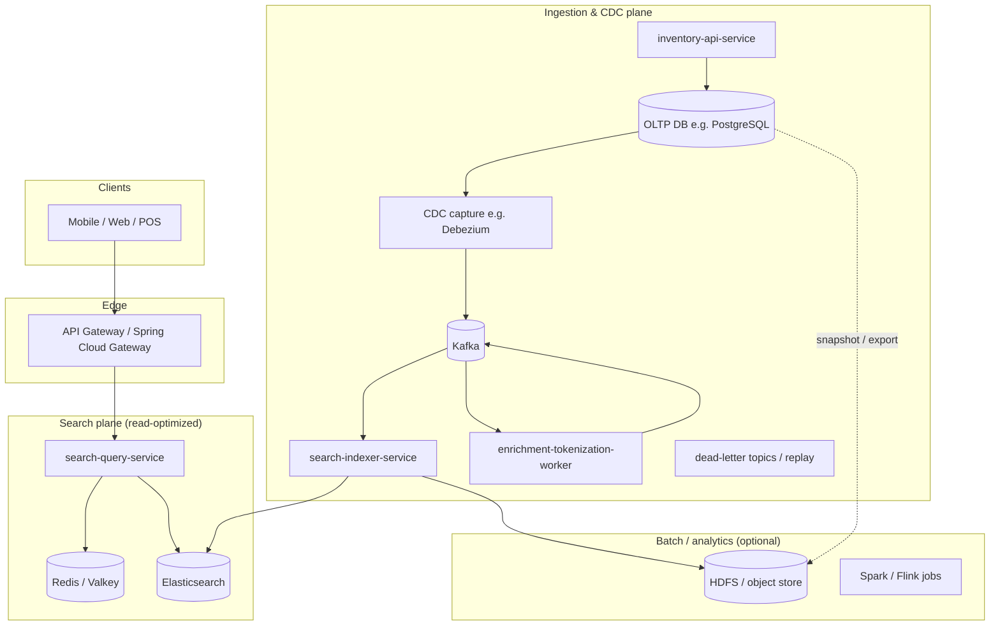

# Grocery Item Search — Architecture & Delivery Plan

This document describes a **planned** software stack and data flows for a **natural-language and recipe-oriented search** feature over retail grocery inventory (name, description, department, and related attributes). It is written from **lead architect** and **lead engineer** perspectives: goals, boundaries, services, CDC, caching, latency expectations, libraries, pitfalls, and a phased rollout. **Implementation is intentionally deferred** until stakeholders review and align on scope.

---

## 1. Objectives

| Goal | Detail |
|------|--------|
| **NL + recipe queries** | Users phrase intent in natural language (“dinner for two under $20”, “ingredients for carbonara”, “gluten-free pasta aisle 3”). Retrieval combines **tokenized full-text search**, **structured filters** (department, store, availability), and optional **query understanding** (synonyms, ingredient expansion). |
| **Tokenization-first** | Similar in spirit to large-scale search: **analyze** queries and documents consistently (normalization, stemming/lemmatization where appropriate, stopwords, language-aware tokenizers), build **inverted indexes**, score with **BM25** (or learned rank later). Elasticsearch provides this out of the box; custom **synonym / entity** layers sit beside it. |
| **Real time** | Inventory changes should become **search-visible within seconds** under normal load (tunable vs. cost). |
| **Scale** | Design for **millions of concurrent end users** (read-heavy): horizontally scaled stateless APIs, Elasticsearch cluster, Kafka, caches, and optional regional replication. |
| **Ease of updates** | **CDC-driven** incremental index updates; **bulk** paths for cold start and disaster rebuild; clear separation of **source of truth** (OLTP) vs. **search index**. |

**Non-goals (initial phase):** Replacing the inventory OLTP database; building a general-purpose web crawler; full semantic/vector-only search (can be phase 2+).

---

## 2. High-Level Architecture (Microservices, Spring, Java 21)



**Service responsibilities (concise):**

| Service | Role |
|---------|------|
| **inventory-api-service** | CRUD and transactional inventory; owns validation and business rules; writes only to OLTP. |
| **search-query-service** | Stateless query API: parse request → optional query rewriting → ES query DSL → merge filters → rank → cache keying; no direct OLTP reads for search. |
| **search-indexer-service** | Consumes normalized **index commands** from Kafka; bulk-upserts to Elasticsearch; handles retries, idempotency, version/tombstones. |
| **enrichment-tokenization-worker** (may be merged with indexer in v1) | Maps CDC events to **search documents**; applies **synonyms**, department hierarchy, recipe/ingredient expansion (if configured); outputs compact **IndexItem** payloads. |
| **API Gateway** | AuthN/Z, rate limits, routing, request IDs; Spring Cloud Gateway is a natural fit. |

**Why not one monolith?** Independent **scaling**, **deploy cadence**, and **blast radius**: query path stays lean while ingestion can spike during bulk loads.

---

## 3. Search Model: Tokenization & “Big Search Engine” Patterns

### 3.1 Document model (Elasticsearch)

Each sellable item (or SKU-store combination, depending on tenancy) becomes a **search document** with fields such as:

- **Text (analyzed):** `name`, `description`, `marketing_copy`, concatenated **ingredients** (if applicable).
- **Keyword (filter/sort):** `department_id`, `category_path`, `brand`, `store_id`, `sku`, dietary tags.
- **Numbers/dates:** `price`, `unit_size`, `updated_at`, `effective_from`.
- **Optional vectors (phase 2+):** embedding of name+description for hybrid retrieval.

**Analyzers:** Language-specific or `english` + **asciifolding**; **edge n-grams** only if you need aggressive prefix match (cost: index size). Prefer **standard + stemming** for grocery prose.

**Synonyms:** Maintain synonym sets (brand ↔ generic, “cilantro” ↔ “coriander leaves” by locale) via **Elasticsearch synonym filters** or **searchable synonym index** updated via the same CDC pipeline.

### 3.2 Query path

1. **Normalize** query string (trim, lowercase for cache keys; analyzer handles linguistic case).
2. **Tokenize / parse** (ES `query_string` or `multi_match` with `best_fields` / `cross_fields`; stricter `match_phrase` for exact phrases).
3. **Filters** (department, store, in_stock) — always applied as **filter context** for caching and speed.
4. **Boost** name over description; penalize stale or discontinued SKUs if business rules require.
5. **Recipe-style queries:** Optional **ingredient dictionary** expansion: map detected ingredients to canonical IDs and add `should` clauses (or a precomputed “recipe compatibility” feature in batch — see Hadoop section).

### 3.3 Libraries (search & text)

| Concern | Preferred stack |
|---------|-----------------|
| ES integration | **Spring Data Elasticsearch** (aligned with Spring Boot) or **Elasticsearch Java API Client** (official) when you need low-level control. |
| HTTP / resilience | **Spring WebFlux** optional for high-concurrency I/O to ES; or **virtual threads** (Java 21) with blocking client + tuned pools. |
| Caching | **Spring Data Redis** + **Caffeine** (local) for hot keys. |

---

## 4. Data Flow: Initialization & Refresh

### 4.1 Cold start (full build)

1. **Snapshot export** from OLTP (parallel **JDBC slice** or **DB dump** to object store/HDFS) **or** bounded **batch API** from inventory service.
2. **Batch job** (Spring Batch on Kubernetes, or Spark if volume is huge) produces **NDJSON / Avro** index batches.
3. **search-indexer-service** (or dedicated batch writer) performs **Elasticsearch `_bulk`** with **refresh** policy tuned for throughput (`wait_for` off during bulk).
4. **Alias swap:** index `items-vNNN` → alias `items-search` to avoid downtime.

**Optimization:** Use **parallel workers** per shard key (e.g. `store_id` hash) and **bulk sizes** 5–15 MB or 1–5k docs (measure).

### 4.2 Steady state (incremental)

1. **CDC** emits row-level **create/update/delete** after OLTP commit.
2. **Kafka** topics carry **canonical change events** (see §6).
3. **Enrichment worker** builds the **search document** and emits **IndexCommand**.
4. **Indexer** applies to ES; **tombstones** remove deleted SKUs.

### 4.3 Full reindex (schema/analyzer change)

- Build **new physical index** with new mapping; replay from **snapshot + tail** or **Kafka compacted topic** of last-known state if you maintain one (advanced); then **alias flip**.

---

## 5. CDC Model (Preferred Design)

### 5.1 Principle

**Source of truth:** OLTP (e.g. PostgreSQL). **Search index** is a **derived view**. CDC guarantees you **do not** couple search latency to OLTP read replicas for every query.

### 5.2 “Our own CDC” vs native tools

| Layer | Recommendation |
|-------|----------------|
| **Capture** | **Debezium** (Kafka Connect) reading **PostgreSQL logical decoding** (or MySQL binlog / SQL Server CDC). This is the industry-standard “native” path with Kafka — you **own** the **contract and transforms** in Spring services, not the low-level binlog parsing. |
| **Transport** | **Apache Kafka** with **Idempotent producer**, **exactly-once** semantics where justified (`transactional.id` for compact flows), **partitioning** by `item_id` or `store_id` for ordering per entity. |
| **Apply** | **Your** `search-indexer-service` (Spring Kafka) implements **idempotent upserts** (external version or `seq` from DB). |

If the organization prohibits Debezium, fallback: **polling JDBC** with `updated_at` + PK (weaker: missed deletes without tombstones, higher latency). Not recommended at scale.

### 5.3 Event shape (illustrative)

```json
{
  "op": "u",
  "ts_ms": 1712345678901,
  "source": { "table": "inventory_item", "lsn": "0/1A2B3C" },
  "before": { "price": 1.99 },
  "after": { "id": "uuid", "store_id": "s1", "name": "...", "department_id": "dairy", "description": "...", "version": 42 }
}
```

Downstream **IndexCommand** (internal):

```json
{
  "document_id": "s1:sku123",
  "operation": "UPSERT",
  "payload": { "... ES document ..." },
  "vector_version": 0
}
```

### 5.4 Ordering & duplicates

- Partition Kafka by **document_id** so all updates for one SKU-store are **ordered**.
- Use **DB version** or **LSN** in the document for **last-write-wins** in ES.

---

## 6. Kafka Topics (Suggested)

| Topic | Content | Notes |
|-------|---------|--------|
| `inventory.cdc.raw` | Debezium envelope | Retention per compliance; compact if you need rebalance (usually not for raw CDC). |
| `search.item.enriched` | Normalized search docs / commands | Produced by Spring worker; schema in **Avro** + **Schema Registry** recommended. |
| `search.index.dlq` | Failed applies | Manual replay after fix. |

---

## 7. Caching Strategy (Speed + Freshness)

| Layer | What | TTL / invalidation |
|-------|------|---------------------|
| **CDN / edge** | Static autocomplete dictionaries, category trees | Long TTL, versioned URLs. |
| **Redis** | Parsed query + filter hash → ES response for **hot queries**; **category facets** | Short TTL (e.g. 30–120s) for NL search; **never** cache personalized results without user scoping. |
| **Caffeine (in-process)** | Synonym maps, department tree, **compiled ES templates** | Reload on config bus or periodic refresh. |
| **Elasticsearch** | Shard request cache, node query cache | Rely on filters for cacheability; tune `refresh_interval` (default 1s). |

**Pitfall:** Caching NL results across users can **leak** pricing or availability; cache keys **must** include `store_id`, **entitlement**, and **pricing context** if those vary.

---

## 8. Hadoop / Elastic Stack / “Native Spring” Placement

| Technology | Role in this design |
|------------|---------------------|
| **Elasticsearch** | Primary **inverted index** + aggregations + optional vectors later. |
| **Kibana** | Ops dashboards, slow query analysis, index health. |
| **Kafka** | Durable CDC bus and backpressure between OLTP rate and indexing rate. |
| **Hadoop (HDFS) + Spark/Flink** | **Optional but valuable:** (1) **historical snapshots** for ML / ranking features, (2) **large bulk rebuilds**, (3) **audit** of what was indexed when. Not on the critical path for **single-digit second** freshness if you skip it in v1. |
| **Spring Boot 3.x + Java 21** | All JVM services; **Spring Cloud** for config/discovery (Kubernetes-native optional). |
| **Spring Kafka** | Consumers/producers for index pipeline. |
| **Spring Batch** | Cold start and periodic reconciliation jobs. |

---

## 9. Latency & Delay Budget (Expected / Calculated)

Assumptions: single region, well-tuned clusters, no major GC pauses. Numbers are **order-of-magnitude** for planning; measure with p50/p95/p99 in implementation.

### 9.1 End-to-end: DB change → searchable

| Stage | Typical delay |
|-------|----------------|
| Commit to WAL / logical decoding availability | **~1–10 ms** |
| Debezium poll + emit to Kafka | **~10–200 ms** (tunable; smaller `max.batch.size` lowers latency, increases overhead) |
| Kafka produce + replicate (acks=all, RF=3) | **~5–50 ms** |
| Consumer fetch + enrich + produce IndexCommand | **~10–100 ms** |
| Indexer bulk to ES + refresh | **~50–500 ms** + **`refresh_interval`** (often **1 s** default) |

**Rough end-to-end (searchable after refresh):** **~0.5–3 s** typical; **sub-second** is achievable with **aggressive** refresh, smaller batches, and co-located clusters (higher ES cost).

**If `refresh=wait_for` on every write:** lower perceived lag, **higher** indexing load — avoid for bulk; use for critical SKUs only if needed.

### 9.2 User query → response

| Stage | Typical delay |
|-------|----------------|
| Gateway + auth | **~1–20 ms** |
| Cache miss path: ES query (cached filters) | **~20–150 ms** depending on complexity, shard count, QPS |
| Cache hit (Redis) | **~1–5 ms** |

**Target:** p95 **< 150–300 ms** for uncached NL queries at scale with proper index sizing and **filter-first** queries.

---

## 10. Maven / Repo Layout (Planned)

After approval, reshape into a **multi-module Maven** project (Java 21):

```
pom.xml                    # parent: dependencyManagement, plugins
search-query-service/
search-indexer-service/
inventory-api-service/     # if owned by same repo; else separate repo
enrichment-worker/
shared-contracts/          # Avro/JSON schemas, DTOs
```

**Parent POM highlights:** `spring-boot-starter-parent` 3.2+, `spring-cloud-dependencies`, `kafka-clients` / `spring-kafka`, `spring-data-elasticsearch` or `co.elastic.clients:elasticsearch-java`, `debezium` only on Connect (not necessarily in app POM), `testcontainers` for integration tests.

**Current repo state:** Planning documents only until feedback; **no service modules are generated yet** in this iteration.

---

## 11. Scaling to Millions of Users

- **Stateless** `search-query-service` behind K8s HPA; scale on CPU and **custom metrics** (ES client pool saturation, Redis latency).
- **Elasticsearch:** separate **master/data/ingest** roles; **index per time-based or store shard** strategy only if proven necessary; avoid over-sharding.
- **Kafka:** partition count sized for **peak indexer parallelism**; separate **consumer groups** for enrichment vs indexing if needed.
- **Multi-region (later):** read-only ES **CCR** (cross-cluster replication) or regional indexes + global routing layer; CDC fan-out is non-trivial — plan **active-active** carefully.

---

## 12. Pitfalls & Challenges

| Risk | Mitigation |
|------|------------|
| **Schema drift** between OLTP and ES | Versioned **IndexCommand** schema; contract tests; feature flags for new fields. |
| **Large catalog bulk loads** | Throttle CDC or pause Debezium during migration; use **bulk** path; monitor **Kafka lag**. |
| **Delete propagation** | Hard deletes must emit **tombstones**; soft deletes map to `active:false` filter. |
| **Over-tokenization** | Too aggressive stemming merges distinct products (“mint” gum vs herb); tune analyzers per field. |
| **Recipe NL ambiguity** | Without ML, queries like “apple” match fruit and tech; use **department boosts**, **user context**, **click feedback** later. |
| **Cache poisoning** | Strict cache key dimensions; WAF + input length limits. |
| **PCI/PII** | Do not index fields you should not expose at search; **field-level security** in ES for restricted catalogs. |
| **Operational complexity** | ES + Kafka + Connect is heavy; start with **managed** offerings where possible. |

---

## 13. Phased Delivery Plan (Post-Feedback)

1. **Phase 0 — Foundations:** Parent POM, one **search-query-service** skeleton, ES cluster (dev), sample index mapping, integration tests with Testcontainers.
2. **Phase 1 — CDC path:** OLTP + Debezium + Kafka + **indexer** + DLQ; measure **lag percentiles**.
3. **Phase 2 — NL quality:** Synonyms, department hierarchy, autocomplete index; Redis caching with safe keys.
4. **Phase 3 — Recipe / ingredients:** Dictionary expansion + optional batch features from HDFS/Spark.
5. **Phase 4 — Scale & resilience:** HPA tuning, multi-AZ, chaos testing, runbooks.

---

## 14. Open Questions for Stakeholders

- OLTP engine (PostgreSQL assumed?) and **expected catalog size** (SKUs × stores).
- **Freshness SLA** (e.g. “99% of updates visible within 5s”) vs cost.
- **Single vs multi-tenant** search (per retailer vs platform).
- **Managed vs self-hosted** Kafka, ES, and Connect.
- Whether **Hadoop** is mandatory in v1 or acceptable as **phase 3** analytics.

---

## 15. Document Control

| Version | Date | Notes |
|---------|------|--------|
| 1.0 | 2025-03-27 | Initial architecture and plan; implementation deferred pending feedback. |
