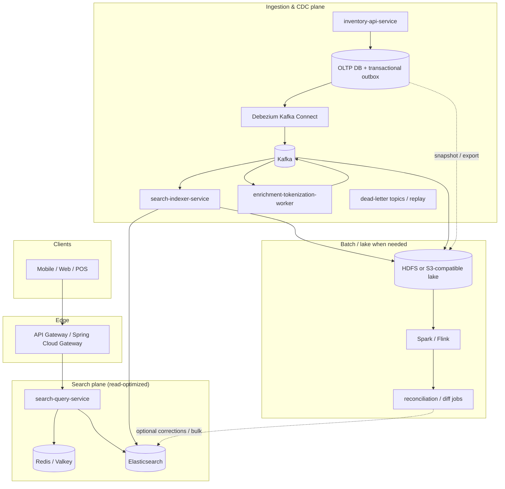
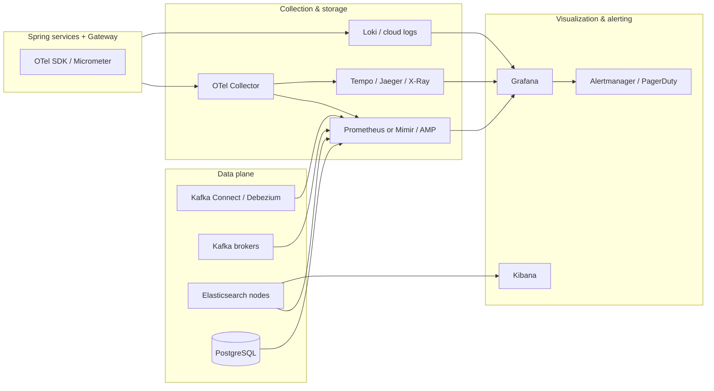

# Grocery Item Search — Architecture & Delivery Plan

This document describes a **planned** software stack and data flows for a **natural-language and recipe-oriented search** feature over retail grocery inventory (name, description, department, and related attributes). It is written from **lead architect** and **lead engineer** perspectives: goals, boundaries, services, **CDC in depth** (with a **decided** pattern: **transactional outbox + Debezium on Kafka Connect**), **index refresh in depth**, Hadoop-backed batch and reconciliation, latency expectations, libraries, **industry parallels, quality attributes, and anti-pattern validation** (**§3.4–§3.5**), long-term risks, **resolved platform defaults** (**§16**), **observability, mitigation, and monitoring** (**§18**), **local demo scope (Docker & Docker Compose)** (**§19**), **optional Kubernetes** (**§20**), **cloud integration mappings (Azure, Google Cloud)** (**§21**), phased rollout, and **relative effort** for key features (**§17**). The architecture stays **cloud-agnostic**; cloud sections are **integration maps**, not lock-in. **Implementation is intentionally deferred** until stakeholders review and align on scope.

---

## 1. Objectives

| Goal | Detail |
|------|--------|
| **NL + recipe queries** | Users phrase intent in natural language (“dinner for two under $20”, “ingredients for carbonara”, “gluten-free pasta aisle 3”). Retrieval combines **tokenized full-text search**, **structured filters** (department, store, availability), and optional **query understanding** (synonyms, ingredient expansion). |
| **Tokenization-first** | Similar in spirit to large-scale search: **analyze** queries and documents consistently (normalization, stemming/lemmatization where appropriate, stopwords, language-aware tokenizers), build **inverted indexes**, score with **BM25** (or learned rank later). Elasticsearch provides this out of the box; custom **synonym / entity** layers sit beside it. |
| **Real time** | Inventory changes should become **search-visible within seconds** under normal load (tunable vs. cost). |
| **Scale** | Design for **millions of concurrent end users** (read-heavy): horizontally scaled stateless APIs, Elasticsearch cluster, Kafka, caches, and optional regional replication. |
| **Ease of updates** | **Transactional outbox** in the inventory service (same database transaction as business writes) + **Debezium** (Kafka Connect) for log-based CDC into **Kafka**, then incremental index updates; **bulk** paths for cold start and disaster rebuild; clear separation of **source of truth** (OLTP) vs. **search index**. |
| **Hadoop when the problem needs it** | Use **HDFS (or cloud object store with Hadoop-compatible APIs)** and **Spark/Flink** for **large-scale snapshotting, reconciliation, feature generation, and full rebuilds**—not as decoration, but wherever volume, audit, or ML pipelines exceed what streaming microservices alone should carry. |

**Non-goals (initial phase):** Replacing the inventory OLTP database; building a general-purpose web crawler; full semantic/vector-only search (can be phase 2+).

**Demo / repository scope:** The **reference implementation** when code lands is bounded to **Docker** images and a **Docker Compose** stack for local and CI demo (**§19**). **Kubernetes** and **managed cloud** services are **documented as next steps**, not required to run the demo.

---

## 2. High-Level Architecture (Microservices, Spring, Java 21)



**Service responsibilities (concise):**

| Service | Role |
|---------|------|
| **inventory-api-service** | CRUD and transactional inventory; owns validation and business rules; persists business rows **and** **outbox events** in the **same local transaction** (transactional outbox). |
| **search-query-service** | Stateless query API: parse request → optional query rewriting → ES query DSL → merge filters → rank → cache keying; no direct OLTP reads for search. |
| **search-indexer-service** | Consumes normalized **index commands** from Kafka; bulk-upserts to Elasticsearch; handles retries, idempotency, version/tombstones. |
| **enrichment-tokenization-worker** (may be merged with indexer in v1) | Maps CDC events to **search documents**; applies **synonyms**, department hierarchy, recipe/ingredient expansion (if configured); outputs compact **IndexItem** payloads. |
| **API Gateway** | AuthN/Z, rate limits, routing, request IDs; Spring Cloud Gateway is a natural fit. |

**Why not one monolith?** Independent **scaling**, **deploy cadence**, and **blast radius**: query path stays lean while ingestion can spike during bulk loads.

---

## 3. Industry Stacks, Open Source, and Long-Term Fit

### 3.1 Patterns seen in industry (analogous systems)

Retail, marketplace, and “catalog + search” systems commonly converge on a small set of **open-source and cloud-neutral** building blocks:

| Pattern | Typical components | Why it appears repeatedly |
|--------|----------------------|---------------------------|
| **Event-driven search index** | OLTP → **log-based CDC** → **Kafka** → stream processors → **Elasticsearch/OpenSearch** | Decouples read models from transactions; tolerates bursty updates; replay for recovery. |
| **Observability around search** | **OpenTelemetry** + **Prometheus/Grafana** + **Elasticsearch/Kibana** (domain-specific) | Unified traces/metrics/logs for microservices **and** deep ES/Kafka/Connect introspection (see **§18**). |
| **Data lake for scale and history** | **HDFS or object store** + **Spark/Flink** for snapshots, training data, reconciliation | Streaming alone is poor at **petabyte-scale history**, cheap retention, and **batch diff** across billions of rows. |
| **API + gateway** | **Spring Cloud Gateway** / Envoy / cloud API gateways | Cross-cutting auth, rate limits, and routing in microservice estates. |

This program **standardizes** on **PostgreSQL (or chosen OLTP) → transactional outbox table → Debezium → Kafka → Spring consumers → Elasticsearch**, which matches common microservice practice (reliable publication without dual writes). §6.5 documents **escape hatches** if a vendor mandates a different capture product feeding the same Kafka topics (Debezium remains the **default implementation**).

### 3.2 Open-source anchor vs proprietary overlay

| Layer | Open-source core | Enterprise overlay (when justified) |
|-------|------------------|--------------------------------------|
| Messaging | **Apache Kafka** | Confluent Platform, MSK, managed Kafka |
| Search | **Elasticsearch** or **OpenSearch** | Elastic Cloud, AWS OpenSearch Service |
| CDC capture | **Debezium on Kafka Connect** (**decided**) | Managed Connect / Confluent; escape hatch: vendor CDC → Kafka if mandated (§6.5) |
| Batch | **Apache Spark**, **Apache Flink**, **Hadoop HDFS** | Databricks, EMR, Dataproc, Cloudera |
| Service stack | **Spring Boot**, **Spring Cloud** | Commercial support, enterprise support contracts |

**Long-term use:** Favor **open protocols** (Kafka, JDBC, ES HTTP APIs) and **schema evolution** (Avro/Protobuf + registry). The **decided** path is **outbox + Debezium**; if operations later prefer **managed** Connect, the **same** Debezium connector model usually applies. Downstream consumers stay stable as long as the **contract topics** (`inventory.outbox.events` → `search.item.enriched`) and **payload schema** evolve compatibly.

### 3.3 System weaknesses and scale issues (architectural)

| Weakness / limit | What breaks first | Mitigation direction |
|------------------|-------------------|----------------------|
| **Elasticsearch cluster limits** | Query p99, merge pressure, shard count | Right-size shards; **forcemerge** discipline; separate **search** vs **indexing** load; autoscaling policies with caps. |
| **Hot keys / hot stores** | Single Kafka partition or single ES routing shard saturates | **Salting** or **sub-partitioning** strategy (§6.3); rate limiting per tenant; async bulk for hot SKUs. |
| **CDC lag under bulk** | Stale search during promotions or catalog imports | **Throttle** or **pause** log consumer; run **bulk Hadoop path**; catch up with **expanded indexer pool**. |
| **Schema drift** | Silent field drops or type conflicts in ES | Registry + **consumer-driven contract tests**; versioned IndexCommand; reindex playbook. |
| **Exactly-once illusion** | Duplicate or out-of-order events | **Idempotent** writes; **monotonic version** per document; compaction only where understood. |
| **Operational sprawl** | On-call fatigue (Kafka + Connect + ES + Hadoop) | Managed services where ROI clear; **golden paths** and runbooks; one “pipeline owner” team. |
| **Multi-region** | Split-brain indexes, conflicting updates | Leader region for writes + **CCR**, or **global ID** + conflict rules; avoid naive dual-write. |

### 3.4 Comparable systems and quality attributes (industry parallels)

Public write-ups and vendor guidance on **catalog / product / inventory search** repeatedly converge on a shape very close to this proposal: **normalized OLTP** for writes, **denormalized search index** for reads (**CQRS**-style separation), **asynchronous synchronization** via **events or CDC**, and **Elasticsearch (or OpenSearch)** for full-text and faceting. Examples include **PostgreSQL → Debezium → Kafka → Spring → Elasticsearch** pipelines described in practitioner articles, **RDBMS + Elasticsearch** “best of both worlds” product search discussions (e.g. [ePages on CQRS with Elasticsearch](https://developer.epages.com/blog/tech-stories/harnessing-the-best-features-of-rdbms-and-elasticsearch-with-cqrs/)), and **real-time inventory** architectures combining **Postgres, Kafka, and Elasticsearch**. Those systems stress **eventual consistency** between OLTP and search, **idempotent** consumers, and **operational** focus on lag and index health—consistent with **§6**, **§7**, and **§18** here.

**Quality attributes** the proposed stack is optimized for (and how they are achieved):

| Attribute | Target behavior | Primary mechanisms |
|-----------|-----------------|-------------------|
| **Availability (read path)** | Search stays up when inventory API blips | Stateless **query service**, ES cluster redundancy, cache (§9), gateway timeouts |
| **Latency (query)** | Low p95/p99 for NL + filters | ES tuning, **filter context**, Redis (§9), avoid `wait_for` on hot path (§7) |
| **Freshness (index)** | Near-real-time after commit | Outbox + Debezium + indexer; **SLOs** in §18.4 |
| **Consistency** | **Eventual** between OLTP and search; no false “strong” guarantee | **OLTP authoritative**; **version/seq** for last-write-wins; reconciliation (§7.4, §11) |
| **Scalability** | Read-heavy, millions of users | Horizontal **query** pods, ES scale-out, Kafka partitions (§6.3, §13, §20) |
| **Durability / recoverability** | Replay after mistakes | Kafka retention, optional **lake** (§11), DLQ + replay |
| **Operability** | Debug pipeline and SLO burn | **§18** metrics/traces; Kibana for ES; runbooks |
| **Security / tenancy** | No cross-tenant leakage | **`tenant_id`** on every query (§16); cache keys; field filtering |
| **Cost tradeoff** | Predictable $ vs freshness | Managed services (§16, §21); refresh and bulk tuning (§7) |

### 3.5 Anti-patterns, counter-designs, and stack validation

Industry and community sources call out **failure modes** that this design **explicitly avoids** or **mitigates**. The table below is a **validation checklist** for design reviews.

| Anti-pattern or counter-design | Failure mode | How this proposal addresses it |
|--------------------------------|--------------|--------------------------------|
| **Dual write** (update PostgreSQL and Elasticsearch in the same request) | One succeeds, one fails → **permanent drift**; every writer must remember both stores | **Single write** to OLTP + **outbox** in one transaction; ES is **derived** only ([dual-write problem](https://www.confluent.io/blog/dual-write-problem/) framing). |
| **“Kafka first, then database”** | Still **two systems** without a common commit; failure order creates inconsistency | **Never** the primary path; outbox keeps **broker publish** after **durable DB commit** via CDC. |
| **Application publishes to Kafka + writes DB** (separate operations) | Same as dual write across **DB and broker** | Replaced by **outbox row in the same TX** as business data. |
| **Raw CDC of all internal tables** into search consumers | **Tight coupling** to schema; accidental **PII** exposure; break on refactors | **Outbox** defines a **stable integration contract**; only intended fields in payload. |
| **Outbox without operational visibility** | Connector or relay stalled → **silent divergence** (“committed in DB, never indexed”) | **§18.3** alerts: Connect **FAILED**, **MilliSecondsBehindSource**, consumer **lag**, outbox **growth**, slot lag. |
| **Outbox without per-aggregate ordering discipline** | Events applied **out of order** → wrong final state | **Monotonic `seq`** (or version) + Kafka key = **`document_id`** (§6.3, §6.8). |
| **Treating Elasticsearch as system of record** | Loss of **ACID**, inventory corruption risk | **OLTP only** as source of truth; ES is a **read model**. |
| **Oversized outbox payloads** | Table bloat, replication cost, replay pain | **Payload caps**; store **references**; enrich downstream if needed. |
| **Ignoring reconciliation** | Bugs or partial failures leave **dangling** drift | **§7.4**, lake/Spark diff, periodic checks. |
| **Synchronous “read your writes” via ES only** | ES refresh latency violates user expectation | Document **eventual consistency**; for rare hard requirements, **read from OLTP** or **routing** + stricter refresh (costly). |
| **Compose / demo mistaken for production HA** | Data loss or split-brain under real failure | **§19** boundaries; production on **§20** + managed data planes. |

**Review ritual:** Before major releases, walk the **§3.5** table and **§18.3** checklist; run a **game day** (pause Connect, spike lag, fail indexer pod) and verify alerts and runbooks.

---

## 4. Search Model: Tokenization & “Big Search Engine” Patterns

### 4.1 Document model (Elasticsearch)

Each sellable item (or SKU-store combination, depending on tenancy) becomes a **search document** with fields such as:

- **Text (analyzed):** `name`, `description`, `marketing_copy`, concatenated **ingredients** (if applicable).
- **Keyword (filter/sort):** `department_id`, `category_path`, `brand`, `store_id`, `sku`, dietary tags.
- **Numbers/dates:** `price`, `unit_size`, `updated_at`, `effective_from`.
- **Optional vectors (phase 2+):** embedding of name+description for hybrid retrieval.

**Analyzers:** Language-specific or `english` + **asciifolding**; **edge n-grams** only if you need aggressive prefix match (cost: index size). Prefer **standard + stemming** for grocery prose.

**Synonyms:** Maintain synonym sets (brand ↔ generic, “cilantro” ↔ “coriander leaves” by locale) via **Elasticsearch synonym filters** or **searchable synonym index** updated via the same CDC pipeline.

### 4.2 Query path

1. **Normalize** query string (trim, lowercase for cache keys; analyzer handles linguistic case).
2. **Tokenize / parse** (ES `query_string` or `multi_match` with `best_fields` / `cross_fields`; stricter `match_phrase` for exact phrases).
3. **Filters** (department, store, in_stock) — always applied as **filter context** for caching and speed.
4. **Boost** name over description; penalize stale or discontinued SKUs if business rules require.
5. **Recipe-style queries:** Optional **ingredient dictionary** expansion: map detected ingredients to canonical IDs and add `should` clauses (or a precomputed “recipe compatibility” feature in batch — see **§11** Hadoop / lake).

### 4.3 Libraries (search & text)

| Concern | Preferred stack |
|---------|-----------------|
| ES integration | **Spring Data Elasticsearch** (aligned with Spring Boot) or **Elasticsearch Java API Client** (official) when you need low-level control. |
| HTTP / resilience | **Spring WebFlux** optional for high-concurrency I/O to ES; or **virtual threads** (Java 21) with blocking client + tuned pools. |
| Caching | **Spring Data Redis** + **Caffeine** (local) for hot keys. |

---

## 5. Data Flow Overview: Initialization vs Steady State

| Mode | Trigger | Primary path | Hadoop role |
|------|---------|--------------|-------------|
| **Cold start** | New environment, new index version | Snapshot/export → batch chunks → `_bulk` → alias swap | **Heavy:** store raw exports, Spark partition and validate, audit trail |
| **Incremental** | Normal operations | CDC → Kafka → enrich → indexer → ES | **Light:** optional mirror of events to lake for replay/analytics |
| **Recovery / reconciliation** | Drift suspected, bad deploy | Compare **lake snapshot** vs ES sample or vs OLTP keys; emit corrective bulk | **Heavy:** diff at scale without hammering OLTP |
| **Full reindex** | Mapping/analyzer change | New physical index + replay | Same as cold start; prefer **time-partitioned** raw data in lake |

Detailed **refresh semantics** (Elasticsearch `refresh`, bulk tuning, staleness) are in **§7**. Detailed **CDC lifecycle and sharding** are in **§6**.

---

## 6. Change Data Capture (CDC) — In Depth

### 6.0 Architectural decision: transactional outbox + Debezium

**Decision (locked for this program):**

| Layer | Choice |
|-------|--------|
| **Publication from inventory** | **Transactional outbox** — `inventory-api-service` inserts **one row per domain event** (or batched payload) into an **`outbox`** table in the **same database transaction** as the business mutation. No “dual write” to Kafka from the app. |
| **Capture into Kafka** | **Debezium** running on **Kafka Connect**, reading the database **transaction log** (e.g. PostgreSQL logical decoding) and emitting change events for the outbox table (and any other captured tables per connector config). |
| **Downstream** | **Spring Kafka** consumers (enrichment, indexer) remain **agnostic** to whether the row was an outbox insert or a raw table change—they only see **Kafka records**. |

**Why outbox + Debezium together:** The outbox **defines the public integration contract** (event type, schema version, payload) and **hides** internal normalized tables from search. Debezium provides **durable, low-latency, log-based** delivery to Kafka with a **well-understood** operational model in Spring + Kafka estates.

**Operational note:** After Kafka has acknowledged a message, a **separate process** (relay, or Debezium **outbox event router** / custom SMT, or periodic cleanup job) should **mark or delete** processed outbox rows to avoid unbounded table growth—design this explicitly in Phase 1.

### 6.1 What “CDC” means in this system

**CDC** is the continuous extraction of **committed** changes from the **system of record** (OLTP) and their reliable delivery to downstream **derived views** (here: the search index and optional data lake). In this architecture, the **primary** change stream for search is **outbox inserts/updates**, not ad hoc “CDC every internal column” unless you explicitly add tables to the connector for enrichment.

**Properties we care about:**

- **Low impact on OLTP:** **Log-based** capture via Debezium (WAL / binlog), not polling-heavy patterns on hot tables.
- **Atomicity with business state:** Outbox row and business row share **one commit** → no lost events if the transaction rolls back.
- **Ordering per aggregate:** Kafka **partition key** = **`document_id`** (or stable hash) derived from the outbox payload (see §6.3).
- **Deletes:** Represent as **outbox events** (`ItemDeleted`, `StoreOfferWithdrawn`) rather than relying on capture of physical deletes of internal tables when possible; soft deletes become **UPSERT** events with `active: false`.
- **Recoverability:** Kafka retention + (optional) lake copy allows **replay** after consumer bugs.

### 6.2 End-to-end CDC process (step-by-step)

```mermaid
sequenceDiagram
  participant App as inventory-api-service
  participant DB as OLTP + outbox table
  participant Cap as Debezium Connect
  participant K as Kafka
  participant Enr as enrichment-worker
  participant Idx as search-indexer-service
  participant ES as Elasticsearch
  participant Lake as HDFS / object store

  App->>DB: BEGIN; UPDATE inventory…; INSERT outbox(payload); COMMIT
  DB-->>Cap: WAL record(s) for committed tx
  Cap->>K: Debezium change event(s) for outbox row
  Note over Cap,K: Extract document_id → Kafka record key
  K->>Enr: consume outbox topic (optional transform)
  Enr->>K: IndexCommand topic
  K->>Idx: consume
  Idx->>ES: index / delete / bulk
  Idx->>Lake: optional append event archive
```

1. **Single transaction** persists business data and the **outbox event** row(s).
2. **Debezium** tails the log and emits events (typically **one Debezium envelope per outbox row insert**). Use **single message transforms (SMTs)** or a **small relay consumer** to unwrap the outbox payload into the **canonical Kafka value** if you want topics to contain only business JSON/Avro.
3. **Kafka** stores the record with replication (`acks=all` where required); **partition key** must be derived consistently for ordering (§6.3).
4. **Enrichment** (optional): expand references, synonyms, or merge with read models; produce **`search.item.enriched`**.
5. **Indexer** applies **idempotent** upsert/delete to Elasticsearch using **`event_version`** or **`monotonic_seq`** carried in the outbox payload.
6. **Archive (recommended at scale):** mirror events to **HDFS/S3** for **replay**, **audit**, and **Spark** jobs.
7. **Outbox cleanup:** after successful publish (or via tombstone strategy), remove or mark outbox rows per retention policy.

### 6.3 Sharding strategy (CDC-specific)

Sharding here means: **how to split the firehose** so that ordering, parallelism, and hotspots remain controlled.

#### 6.3.1 Kafka partitioning

| Decision | Recommendation |
|----------|------------------|
| **Partition key** | **`document_id`** (e.g. `tenant:storeId:sku` or hash thereof). Guarantees **per-document ordering** if producers use the same key. |
| **Partition count** | Set from **peak sustained write RPS** and **desired consumer parallelism**, not from catalog size alone. Rebalancing partitions is painful—start with headroom (e.g. 2–4× current indexer instances). |
| **Co-partitioning** | If enrichment produces to `search.item.enriched`, use the **same key** so a **single-threaded consumer per partition** can assume locality (or use **Kafka Streams** / **Flink** with consistent keying). |
| **Multi-table / multi-aggregate** | Prefer **one outbox event** per business use case that already reflects the **search document** (or a clear delta). If internal tables must stay separate, either **emit multiple coordinated outbox events** in one TX with shared **`correlation_id`**, or use **enrichment** with a **state store** (Flink)—higher complexity. |

#### 6.3.2 Hotspot mitigation

**Problem:** A national promotion updates **one SKU** across all stores → millions of events with the **same key** if key is only `sku` (bad: one partition) or **storm** if key is `store:sku` (good spread but huge fan-out).

**Tactics:**

- **Batch within capture or enrichment:** collapse many row updates into one **IndexCommand** per document where the pipeline allows.
- **Separate “bulk promotion” API** that writes a **single config document** (“promo_id affects SKUs filter”) interpreted at query time — avoids indexing every row when business allows.
- **Salting for rare mega-keys:** only if a single key dominates; usually better to fix **data model** or **promotion representation**.

#### 6.3.3 Elasticsearch routing (related, not Kafka)

Use **`routing`** (same value as Kafka key where possible) so **co-located shards** reduce scatter-gather for **per-store** queries. Do **not** overuse custom routing without measuring — it can create **uneven shard sizes**.

### 6.4 Debezium in the stack (components and responsibilities)

| Component | Responsibility |
|-----------|----------------|
| **Kafka Connect cluster** | Runs **Debezium** connector(s); HA Connect workers; connector config in Git / ConfigMaps. |
| **Debezium connector** | Captures **outbox** table (and optionally reference tables if justified); emits to **`inventory.outbox.events`** (or single DB server topic with SMT routing). |
| **Schema Registry** | Registers **Avro** (recommended) or **JSON Schema** for outbox payload after unwrap, and for **`search.item.enriched`**. |
| **SMT / relay (optional)** | Unwraps Debezium envelope to **plain business event**; sets **Kafka key** from `document_id` inside payload. |
| **Spring services** | **Do not** embed Debezium; they consume/produce Kafka only. |

**Compatibility:** Debezium **PostgreSQL** connector requires **`wal_level=logical`**, a **replication slot**, and operational discipline on **disk** and **slot lag** (monitoring alerts when Connect is down).

### 6.5 Escape hatches if Debezium cannot run (comparison only)

**Standard for this repo:** **Transactional outbox + Debezium on Kafka Connect.** The table below is for **exceptional** enterprise constraints (e.g. DBA mandate, unsupported topology). If you switch capture, **preserve** the **outbox table** and **Kafka topic contracts** so Spring consumers are unchanged.

| Option | When to consider | Implication |
|--------|------------------|-------------|
| **Confluent Cloud / MSK Connect (managed Debezium)** | Same pattern, less Connect SRE toil | Same connector semantics; vendor SLAs |
| **Oracle GoldenGate / Qlik / Striim → Kafka** | Mandated vendor CDC | Bridge to **same** topic names and schemas; extra licensing and mapping layer |
| **AWS DMS → Kafka / Kinesis** | AWS-only shop, managed preference | Validate **latency**, **delete** semantics, and **transform** limits vs Debezium |
| **GCP Datastream → GCS / BigQuery → bridge** | GCP anchor | Usually **extra hop** to Kafka; only if platform standard forbids self-managed Connect |
| **JDBC polling on outbox** | Temporary / dev-only | Higher DB load; use only short term |

### 6.6 Compatibility with existing microservices environments

- **Service mesh / discovery:** CDC consumers are just **more Kafka consumer groups**; they honor the same **config server**, **secrets**, and **observability** as other Spring services.
- **Multi-team ownership:** Define **data contracts** at the **`search.item.enriched`** boundary; inventory team owns **outbox** or **CDC source** quality; search team owns **mapping** and ES health.
- **Feature flags:** New fields flow **schema version** in Avro; old indexers **ignore** unknowns until rollout.

### 6.7 Testing strategy (CDC-aware)

| Test type | Approach |
|-----------|----------|
| **Local / CI integration** | **Testcontainers:** PostgreSQL + Kafka + (Debezium container or simplified producer stub). Debezium documents **Testcontainers** integration for connector tests. |
| **Contract tests** | Consumers run against **recorded fixtures** (Avro/JSON) checked into repo; CI verifies **backward compatibility**. |
| **End-to-end staging** | Mirror **topic retention**, **partition count**, and **ES cluster sizing** at reduced scale; chaos: kill indexer, verify **lag recovery** without corruption. |
| **Load tests** | Replay **lake-resident** event files into a dedicated cluster to simulate **promotion spikes**. |

Avoid relying solely on **mocks** for CDC: the failure modes are **ordering**, **duplicates**, and **late schema** — integration tests should exercise those.

### 6.8 Event shapes (reference)

**Outbox row (written by `inventory-api-service`, same TX as business data):**

| Column | Purpose |
|--------|---------|
| `id` | UUID primary key |
| `aggregate_type` | e.g. `InventoryItem` |
| `aggregate_id` | Business id for debugging |
| `type` | Event type, e.g. `ItemSearchUpsert`, `ItemSearchDelete` |
| `payload` | **JSON or Avro binary** — canonical fields for search pipeline |
| `created_at` | Server timestamp |

**After unwrap (Kafka value on `inventory.outbox.unwrapped` or primary consumer topic), illustrative:**

```json
{
  "event_type": "ItemSearchUpsert",
  "schema_version": 3,
  "document_id": "tenant1:s42:sku123",
  "seq": 9001,
  "occurred_at": "2025-03-27T12:00:00Z",
  "data": {
    "name": "...",
    "description": "...",
    "department_id": "dairy",
    "store_id": "s42",
    "active": true
  }
}
```

**Debezium envelope** still wraps the above at the connector output until an SMT/relay strips metadata—**do not** couple indexer tests to raw envelope fields; test the **unwrapped** contract.

**Internal IndexCommand:**

```json
{
  "document_id": "s1:sku123",
  "operation": "UPSERT",
  "payload": { "... ES document ..." },
  "vector_version": 0
}
```

**Ordering rule:** Indexer applies **only if** `payload.version` (or LSN) is **≥** stored version; otherwise **discard** as stale.

---

## 7. Refreshing Search Data (Elasticsearch) — In Depth

“Refresh” spans **near-real-time visibility** (streaming path) and **bulk correctness** (batch path).

### 7.1 Elasticsearch refresh and segments

- Each index has a **`refresh_interval`** (often **1s** in near-real-time systems). Between refreshes, newly indexed docs may not appear in **search** (though **get-by-id** can behave differently depending on version/settings).
- **`refresh=wait_for`** on writes **waits** until the next refresh after the write—**better freshness**, **higher** indexing cost. Use **selectively** (e.g. admin tools), not for all catalog writes.
- **Bulk indexing** for cold start should use **`refresh=false`** during the load and run **`_refresh`** once at the end (or rely on alias swap after a forced refresh) to maximize throughput.

### 7.2 Streaming path (CDC → ES)

| Knob | Tradeoff |
|------|----------|
| **Bulk batch size / linger** | Larger batches → higher throughput, **slightly** higher tail latency |
| **Indexer concurrency** | More consumers up to **ES thread pools** / **rejections**; watch `esRejectedExecution` |
| **`refresh_interval` temporarily raised** during catch-up | Faster catch-up; **temporary** search staleness — communicate if doing live |
| **Priority lanes (advanced)** | Separate topics for **price** vs **content** if SLAs differ |

### 7.3 Cold start and full reindex

1. Export **consistent snapshot** (DB dump, JDBC parallel export, or vendor tool) into **HDFS/S3**.
2. **Spark** validates, **normalizes**, and writes **bulk NDJSON** or parallel **bulk API** workers.
3. Index into **`items-vNNN`** with **no** alias until complete; run **query validation** (sample queries, counts).
4. **Atomic alias flip** `items-search` → `items-vNNN`; retire old index after retention policy.

### 7.4 Reconciliation (where Hadoop earns its place)

Periodic or on-demand jobs:

- **Count / checksum** compare OLTP keys vs ES (sampling + full for small tenants).
- **Diff** from **last lake snapshot** vs **current ES** export (Spark) for **large** catalogs without pounding OLTP.
- Emit **corrective** `IndexCommand` stream or **bulk** patch.

This closes the gap when **consumer bugs**, **DLQ replays**, or **partial failures** occurred.

### 7.5 Cache invalidation tied to refresh

- Redis caches keyed by **query hash + store + policy version**; bump **policy version** when **synonym** or **boost** config changes.
- Do **not** assume CDC latency equals **cache TTL**; keep TTLs **short** for volatile pricing if legally required.

---

## 8. Kafka Topics (Suggested)

| Topic | Content | Notes |
|-------|---------|--------|
| `inventory.outbox.events` | Debezium change events for **outbox** table (unwrap downstream) | **Primary** ingress topic; retention per compliance; partition key from **`document_id` in payload** (after unwrap) |
| `inventory.outbox.events.dlq` (optional) | Bad records from unwrap/validation | Inspect and replay after fix |
| `search.item.enriched` | Normalized search docs / commands | Avro + **Schema Registry**; **partition = document_id** |
| `search.index.dlq` | Failed applies | Replay tooling; alert on growth |
| `search.events.archive` (optional) | Copy for lake | Compact or time-partitioned in HDFS for **replay** |

---

## 9. Caching Strategy (Speed + Freshness)

| Layer | What | TTL / invalidation |
|-------|------|---------------------|
| **CDN / edge** | Static autocomplete dictionaries, category trees | Long TTL, versioned URLs. |
| **Redis** | Parsed query + filter hash → ES response for **hot queries**; **category facets** | Short TTL (e.g. 30–120s) for NL search; **never** cache personalized results without user scoping. |
| **Caffeine (in-process)** | Synonym maps, department tree, **compiled ES templates** | Reload on config bus or periodic refresh. |
| **Elasticsearch** | Shard request cache, node query cache | Rely on filters for cacheability; tune `refresh_interval` (default 1s). |

**Pitfall:** Caching NL results across users can **leak** pricing or availability; cache keys **must** include `store_id`, **entitlement**, and **pricing context** if those vary.

---

## 10. Hadoop, Elastic Stack, and Spring Placement

| Technology | Role in this design |
|------------|---------------------|
| **Elasticsearch** | Primary **inverted index** + aggregations + optional vectors later. |
| **Kibana** | Ops dashboards, slow query analysis, index health. |
| **Kafka** | Durable CDC bus and backpressure between OLTP rate and indexing rate. |
| **Hadoop HDFS (or S3 + Hadoop-compatible tooling)** | **When needed:** durable **raw CDC archives**, **full-catalog snapshots**, **Spark** input for reconciliation, **ML feature** generation, **audit** trails. |
| **Spark / Flink** | Large **bulk** builds, **diff/reconciliation**, **stream processing** if enrichment outgrows simple consumers. |
| **Spring Boot 3.x + Java 21** | All JVM services; **Spring Cloud** for config/discovery (Kubernetes-native optional). |
| **Spring Kafka** | Consumers/producers for index pipeline. |
| **Spring Batch** | Orchestrated exports and **chunk** processing when Spark is overkill. |

**Rule of thumb:** If the team can bound catalog size and replay purely from Kafka retention, Hadoop can be **lighter**. If **multi-year history**, **regulatory audit**, or **billion-row** reconciliation is expected, **commit to the lake** early.

---

## 11. Latency & Delay Budget (Expected / Calculated)

Assumptions: single region, well-tuned clusters, no major GC pauses. Numbers are **order-of-magnitude** for planning; measure with p50/p95/p99 in implementation.

### 11.1 End-to-end: DB change → searchable

| Stage | Typical delay |
|-------|----------------|
| Commit to WAL / logical decoding availability | **~1–10 ms** |
| Capture connector emit to Kafka | **~10–200 ms** (tunable) |
| Kafka produce + replicate (acks=all, RF=3) | **~5–50 ms** |
| Consumer fetch + enrich + produce IndexCommand | **~10–100 ms** |
| Indexer bulk to ES + refresh | **~50–500 ms** + **`refresh_interval`** (often **1 s** default) |

**Rough end-to-end (searchable after refresh):** **~0.5–3 s** typical; **sub-second** is achievable with **aggressive** refresh, smaller batches, and co-located clusters (higher ES cost).

### 11.2 User query → response

| Stage | Typical delay |
|-------|----------------|
| Gateway + auth | **~1–20 ms** |
| Cache miss path: ES query (cached filters) | **~20–150 ms** depending on complexity, shard count, QPS |
| Cache hit (Redis) | **~1–5 ms** |

**Target:** p95 **< 150–300 ms** for uncached NL queries at scale with proper index sizing and **filter-first** queries.

---

## 12. Maven / Repo Layout (Planned)

After approval, reshape into a **multi-module Maven** project (Java 21):

```
pom.xml                    # parent: dependencyManagement, plugins
search-query-service/
search-indexer-service/
inventory-api-service/     # if owned by same repo; else separate repo
enrichment-worker/
shared-contracts/          # Avro/JSON schemas, DTOs
```

**Parent POM highlights:** `spring-boot-starter-parent` 3.2+, `spring-cloud-dependencies`, `kafka-clients` / `spring-kafka`, `spring-data-elasticsearch` or `co.elastic.clients:elasticsearch-java`, **Micrometer Observation + OpenTelemetry** (`micrometer-tracing-bridge-otel`, OTLP exporter), `testcontainers`, optional `debezium-testing-testcontainers` for pipeline integration tests.

**Current repo state:** Planning documents only until feedback; **no service modules are generated yet** in this iteration.

---

## 13. Scaling to Millions of Users

- **Stateless** `search-query-service` behind K8s HPA; scale on CPU and **custom metrics** (ES client pool saturation, Redis latency).
- **Elasticsearch:** separate **master/data/ingest** roles; avoid over-sharding; use **routing** judiciously (see §6.3.3).
- **Kafka:** partition count sized for **peak indexer parallelism**; **shard** by `document_id` (§6.3).
- **Multi-region (later):** read-only ES **CCR** or regional indexes + global routing; CDC fan-out is non-trivial — plan **active-active** carefully.

---

## 14. Pitfalls & Challenges (Extended)

| Risk | Mitigation |
|------|------------|
| **Schema drift** between OLTP and ES | Versioned **IndexCommand** schema; contract tests; feature flags for new fields. |
| **Large catalog bulk loads** | Throttle or pause **Debezium** connector; use **bulk + Hadoop** path; monitor **Kafka lag** and **replication slot lag**. |
| **Delete propagation** | Emit **`ItemSearchDelete`** (or equivalent) **outbox events**; avoid relying on physical deletes of internal tables for downstream sync. Soft deletes: **UPSERT** with `active:false`. |
| **Outbox table growth** | **Cleanup** after confirmed Kafka publish (relay + idempotency); partition or archive old rows; alert on table size. |
| **Over-tokenization** | Too aggressive stemming merges distinct products (“mint” gum vs herb); tune analyzers per field. |
| **Recipe NL ambiguity** | Use **department boosts**, **user context**, **click feedback** later. |
| **Cache poisoning** | Strict cache key dimensions; WAF + input length limits. |
| **PCI/PII** | Do not index forbidden fields; **field-level security** in ES where needed. |
| **Connector upgrades** | Pin versions; test **WAL slot** behavior on PostgreSQL upgrades. |
| **Vendor lock-in on CDC** | Keep **downstream topic contract** stable; swap capture layer if needed. |
| **Silent outbox / pipeline stall** | Search **lags** OLTP with no user-visible error | **§18.3** alerts; synthetic **canary** event; dashboard “time since last indexed doc”. |
| **Per-aggregate event reordering** | Stale **UPSERT** overwrites newer state | **`seq`/version** monotonic per `document_id`; drop stale (§6.8). |
| **Assuming “exactly-once” end-to-end** | Double processing after retries | **Idempotent** indexer; at-least-once Kafka semantics accepted. |
| **PII in search payloads** | Compliance breach | **Field allow-list** in outbox builders; audit **enrichment**; ES **field-level security** if needed. |
| **Managed Kafka API gaps** (e.g. some broker compatibility surfaces) | Connect / transactions / ACL mismatch | **Spike** in non-prod (§21); fallback **Strimzi** on Kubernetes. |

---

## 15. Phased Delivery Plan (Post-Feedback)

1. **Phase 0 — Foundations:** Parent POM, **search-query-service** skeleton, ES cluster (dev), sample index mapping, **Testcontainers** ES + Redis tests; **`docker-compose`** demo stack (**§19**) for manual E2E; baseline **§18** (OTel + scrape targets + SLO drafts).
2. **Phase 1 — Outbox + Debezium:** Outbox schema and writes in **inventory-api-service**; **Kafka Connect + Debezium** connector; unwrap/SMT or relay; **`search.item.enriched`** + **indexer** + DLQ; **dashboards and alerts** for pipeline lag, Connect health, and ES indexing (§18.3).
3. **Phase 1b — Lake (when catalog or audit needs it):** Archive topic to **HDFS/S3**; document **replay** procedure.
4. **Phase 2 — NL quality:** Synonyms, department hierarchy, autocomplete; Redis caching with safe keys.
5. **Phase 3 — Recipe / ingredients + batch features:** Spark jobs from lake for enrichment signals.
6. **Phase 4 — Scale & resilience:** **Kubernetes** rollout (**§20**) where applicable; HPA tuning, multi-AZ, chaos testing, reconciliation jobs, runbooks.
7. **Ongoing:** Re-validate **§3.5** anti-patterns after major schema or connector changes; **game day** exercises per **§3.5** review ritual.

---

## 16. Resolved architecture decisions (industry alignment)

Former “open questions” are resolved here with **defaults** that match common **cloud-native / event-driven** practice (2024–2026). **Org-specific inputs** (exact SKU counts, regulatory zone, cloud contract) still refine capacity numbers but no longer block architectural direction.

### 16.1 Data plane defaults

| Topic | Default decision | Rationale (industry / practice) | When to deviate |
|-------|------------------|--------------------------------|-----------------|
| **OLTP** | **PostgreSQL** as reference platform for v1 | Mature **Debezium PostgreSQL** connector, logical decoding, operational playbooks; aligns with most greenfield microservice estates | **Oracle / SQL Server** already mandated → use same **outbox** table and §6.5 **escape hatch** CDC to **identical Kafka topics**; do not fork consumer code. |
| **Catalog scale** | Design for **10⁷–10⁹** doc IDs (SKU×store×tenant) with **horizontal scaling** | Retail search indices are shard- and partition-bound; size drives **partition count** and **ES data nodes**, not pattern choice | Capacity review when **single-tenant** doc count exceeds planned **shard** budget. |
| **Freshness SLO** | Target **p99 end-to-end visibility ≤ 5s** under normal load; **p99.9** may be **≤ 15s** during catch-up | Matches common “near-real-time search” expectations; **ES `refresh_interval`** (often 1s) dominates tail | Stricter SLA → `refresh=wait_for` for selective writes, **dedicated** indexing tier, or **accept higher ES cost**. |
| **Multi-tenant** | **Shared** Elasticsearch cluster + **mandatory `tenant_id` filter** on every query + **`tenant_id` in document_id** prefix | Industry default for SaaS catalog search; cost-efficient | **Dedicated cluster per retailer** when contract, noisy neighbor, or compliance requires isolation. |
| **Kafka / ES / Connect hosting** | **Managed-first** (any cloud or Confluent Cloud) + **§21** maps for **Azure** / **Google Cloud** | Reduces on-call for broker/Connect HA; team focuses on **schemas and consumers** | Self-managed on **Kubernetes** (**§20**) or VMs for **regulatory**, **egress**, or **unit economics** after explicit TCO review. |
| **Vendor CDC mandate** | Keep **outbox + topic contracts**; replace capture with §6.5 path | Avoids rewriting **Spring consumers** | DBA/platform team delivers **Kafka mirror** with same **keying** and **payload** after unwrap. |
| **Lake (Hadoop/S3) timing** | **Phase 1b** default: rely on **Kafka retention** + replay for weeks-scale recovery; **add lake** when audit, **multi-year** retention, or **Spark** reconciliation/ML is required | Industry pattern: stream for real time, **object store** for cheap history | Regulated audit from day one → **Phase 1** mirror `search.*` topics to **S3/HDFS**. |

### 16.2 Conflicts resolved

| Conflict | Resolution |
|----------|------------|
| **Debezium vs enterprise CDC** | **Debezium default**; enterprise CDC is a **drop-in replacement at the broker edge** only. |
| **Outbox vs raw table CDC** | **Outbox wins** for search ingress; raw table CDC only for **internal** analytics if needed, not for public search contract. |
| **OpenSearch vs Elasticsearch** | Either is valid; **same** observability pattern (§18). Choose based on **license/support** policy; avoid mixing in one environment. |
| **Observability: one vendor vs OSS** | **OpenTelemetry** as **vendor-neutral** instrumentation; backends can be **Grafana Cloud**, **Datadog**, **Elastic Observability**, or self-hosted **Prometheus + Tempo + Loki** (§18.1). |

### 16.3 Remaining inputs (capacity only, not architecture)

- Exact **peak writes/sec** to outbox and **query QPS** for sizing Kafka partitions and ES nodes.
- **Data residency** per country for Kafka/ES/logs.
- **IdP** for gateway (OAuth2/OIDC vendor) — does not change pipeline design.

---

## 17. Key features — relative effort (engineering units)

Effort is expressed as **T-shirt size** for a **mature team** already familiar with Spring and Kafka. Sizes mean: **S** = small isolated change, **M** = multiple components or moderate unknowns, **L** = broad surface area or hard non-functionals, **XL** = program-level (many teams, long-lived operational burden). **Not calendar estimates.**

| Feature / deliverable | Size | Primary scope |
|----------------------|------|----------------|
| Parent POM, conventions, shared **Avro** modules | **S** | Build, CI, `shared-contracts` |
| **search-query-service** skeleton + ES mapping + health | **M** | Boot app, ES client, Docker/Testcontainers smoke |
| **`docker-compose.yml`** demo (PG, Kafka, Connect+Debezium, ES, Redis, services) | **S–M** | Not production-HA; documented limits (**§19**) |
| **Transactional outbox** table + write path in inventory API | **M** | DB migration, TX boundary, event builders, payload caps |
| **Debezium** connector + Connect HA + PostgreSQL **logical replication** | **M–L** | Slots, monitoring, playbook for connector pause/failover |
| Unwrap pipeline (**SMT** or small **relay** consumer) + partition key | **M** | Key extraction, Schema Registry, error handling |
| **search-indexer-service** + idempotent ES bulk + DLQ | **L** | Backpressure, retries, version discipline, load tests |
| **enrichment-worker** (synonyms, department tree, joins) | **L** | State, config reload, optional Flink later |
| **Redis** query cache with safe multi-tenant keys | **M** | Key design, TTL policy, invalidation hooks |
| **Spring Cloud Gateway** routes + auth integration | **M** | Depends on IdP and org standards |
| Cold start **bulk** + alias flip (Spring Batch or Spark) | **L** | Consistent snapshot, validation, rollback story |
| **Hadoop/lake** archive + Spark **reconciliation** job | **L** | Storage layout, IAM, scheduling, diff logic |
| NL / recipe **ingredient expansion** + ranking tweaks | **L–XL** | Product + data science iteration, not just code |
| **Multi-region** search + CDC fan-out | **XL** | CCR, routing, conflict rules, operational maturity |
| End-to-end **Testcontainers** (PG + Kafka + Connect/Debezium + ES) | **M–L** | CI time, flake control, fixture maintenance |
| **Observability baseline** (§18): OTel in all Spring services, scrape configs, core Grafana dashboards | **M** | PagerDuty/alert routing is org-specific |
| **Design validation kit**: **§3.5** checklist in CI/docs, optional **game day** runbook | **S–M** | Proves alerts and replay, not feature code |

**Critical path for “search updates from inventory”:** outbox → Debezium → unwrap → indexer → ES (**M + M–L + M + L** in aggregate complexity, with parallelism possible between Connect setup and indexer development).

---

## 18. Observability stack, mitigation, and monitoring

This section aligns with **current industry practice**: **OpenTelemetry (OTel)** as the **CNCF**-standard telemetry API/SDK, **Micrometer Observation** in Spring Boot 3 for unified metrics/tracing, **Prometheus-style** metrics collection, and **Grafana** (or cloud equivalents) for dashboards—**alongside** Elasticsearch’s native **Kibana** views for search-specific diagnostics.

### 18.1 Reference observability architecture



| Layer | Recommended components | Role |
|-------|------------------------|------|
| **Instrumentation** | **Spring Boot 3** + **Micrometer** + **micrometer-tracing-bridge-otel**; enable **Kafka** `observationEnabled` on **KafkaTemplate** and listener containers for **trace propagation** via headers | Single pattern for HTTP + Kafka + JDBC spans; **W3C tracecontext** |
| **Export** | **OTLP** to **OpenTelemetry Collector** (sidecar or DaemonSet) | Vendor-neutral fan-out to metrics, traces, logs |
| **Metrics** | **Prometheus** scrapes (apps, **Kafka Exporter**, **JMX Exporter** on Connect workers, **postgres_exporter**, **redis_exporter**, ES **Prometheus module** or Elastic Agent metrics) | SLO dashboards and alerting |
| **Traces** | **Grafana Tempo**, **Jaeger**, or cloud **APM** | End-to-end **inventory → Kafka → indexer → ES** latency breakdown |
| **Logs** | **Structured JSON** (trace_id/span_id injected) → **Loki**, **OpenSearch**, or cloud logging | Correlate with traces; **never** log PII payloads |
| **Search-native UI** | **Kibana** (or OpenSearch Dashboards): slow logs, index health, thread pools | Complements Grafana for ES internals |
| **Alerting** | **Alertmanager**, Grafana Alerting, or cloud equivalent | Routes to on-call; **runbooks** link from alert annotations |

**Managed equivalent:** AWS **AMP + AMG + X-Ray**, **Azure Monitor + Application Insights**, **Google Cloud Observability** (Cloud Monitoring + Cloud Trace), Datadog/New Relic **with OTel ingest**—same **instrumentation** in application code. See **§21** for Azure/GCP service names.

### 18.2 Mitigation catalog (risk → action → owner)

| Risk | Mitigation | Primary owner |
|------|------------|----------------|
| **Search results stale vs OLTP** | Idempotent indexer + **version** in payload; **reconciliation job** from lake (§11); feature flag to **pause** bad consumers | Search platform |
| **Connector stops / slot bloat** | **HA Connect** cluster; **automated restart**; monitor **replication lag** and **slot** size; runbook to **drop/recreate** slot only with **full replay** plan | Data platform / DBA |
| **Kafka lag explosion** | **Scale consumers** (HPA on lag metric); **throttle** upstream bulk; temporary **increase partitions** only with **rekey** plan | Streaming team |
| **ES indexing overwhelms queries** | **Separate ingest-coordinating** nodes or **indexing window** tuning; **bulk** tuning; **circuit breaker** alerts | Search platform |
| **Bad deploy corrupts mapping** | **Blue/green** index + **alias flip**; **DLQ** growth alert stops blast radius | Search platform |
| **Outbox unbounded growth** | **Cleanup job** with **idempotency store**; **partition** outbox by month if needed; alert on **row count** and **table size** | Inventory service |
| **Cache leak / wrong tenant data** | **Mandatory** `tenant_id` + store in cache key; **TTL** caps; **WAF** on query length | API / security |

### 18.3 Monitoring checklist (what to alert on)

| Component | Metric / signal | Why it matters | Example alert condition |
|-----------|-----------------|----------------|-------------------------|
| **PostgreSQL** | **Replication slot lag** (WAL retained for Debezium) | Disk fill / CDC stall | Lag **> N GB** or **> T minutes** |
| **PostgreSQL** | **Outbox table row count / growth rate** | Unbounded outbox if cleanup fails | Growth **> threshold/hour** sustained |
| **Debezium / Connect** | Connector **FAILED**, task failures | No events to search | State != RUNNING **> 1 min** |
| **Debezium** | **MilliSecondsBehindSource** (or equivalent lag MBean) | End-to-end freshness | **p99 > freshness SLO** |
| **Kafka** | **Consumer group lag** (`enrich`, `indexer`) | Stale index | Lag **> N messages** or **age > SLO** |
| **Kafka** | **Under-replicated partitions**, **offline brokers** | Durability risk | Any **URP > 0** sustained |
| **Spring consumers** | **Processing latency**, **error rate** by topic | Hotspots / bad payloads | Error rate **> X%** |
| **Elasticsearch** | **Indexing rate**, **bulk rejections**, **thread pool rejections** | Pipeline backpressure | Rejections **> 0** sustained |
| **Elasticsearch** | **Search latency** (p95/p99), **heap**, **GC** | User experience | p99 **> budget** |
| **Elasticsearch** | **Cluster health RED**, **unassigned shards** | Outage | Health **RED** |
| **Redis** | **evicted_keys**, **used_memory**, **latency** | Cache collapse | Evictions **> 0** if policy should be no-evict |
| **API Gateway + query svc** | **HTTP 5xx**, **latency**, **saturation** | User-facing | SLO burn rate |

**Synthetic checks:** Periodic **canary query** (known SKU) + **canary outbox event** in non-prod or shadow topic validates **end-to-end** without user traffic.

### 18.4 SLOs and error budgets (starting point)

| SLO | Target | Measurement |
|-----|--------|-------------|
| **Search API availability** | 99.9% monthly | Gateway **2xx** excluding client errors |
| **Search query latency** | p95 **< 300 ms**, p99 **< 800 ms** (uncached) | Server-side span from gateway to ES |
| **Index freshness** | **p99** pipeline **< 5s** from outbox commit to **search-visible** | Synthetic or tagged canary + **lag metrics** |
| **Indexer correctness** | **Zero unbounded DLQ growth** | DLQ rate with **budget** for known bad vendor rows |

Tune numeric thresholds after baseline load tests; **error budget** policy (when to freeze features vs fix reliability) is a **product + SRE** agreement.

---

## 19. Local demo scope: Docker and Docker Compose

The **project demo** and **early integration scope** are intentionally limited to **containers** orchestrated with **Docker Compose**. This keeps onboarding and CI reproducible without a cluster credential.

### 19.1 What the Compose stack should include

| Service | Image / pattern | Role in demo |
|---------|-----------------|--------------|
| **PostgreSQL** | Official `postgres` (version pinned) | OLTP + **transactional outbox**; `wal_level=logical` for Debezium |
| **Apache Kafka** | Bitnami or Confluent **Kafka** (KRaft mode preferred to drop ZooKeeper) | Event bus |
| **Kafka Connect + Debezium** | Debezium Connect image or Connect worker + Debezium plugin | Captures outbox table → Kafka topic |
| **Elasticsearch** | Elastic Docker image (license terms apply) or **OpenSearch** | Search index |
| **Redis** | Official `redis` | Optional query cache in demo |
| **Spring services** | **Built from Dockerfile** (multi-stage Maven → JRE 21) | `inventory-api-service`, `search-query-service`, `search-indexer-service`, `enrichment-worker`, optional **Spring Cloud Gateway** |
| **Observability (optional in demo)** | **OTel Collector**, **Prometheus**, **Grafana** | Mirrors §18 locally |

### 19.2 Compose boundaries (explicit)

- **Single-host**, **no HA**: acceptable broker/Connect restarts; not a production SLA.
- **Resource pins:** JVM `-Xmx`, ES `ES_JAVA_OPTS`, Kafka heap—document **minimum laptop specs** in `compose/README` when implemented.
- **Secrets:** `.env` / Docker secrets for demo only; **Kubernetes/cloud** use **External Secrets** or vault integration (**§20**, **§21**).
- **Networking:** fixed service DNS names (`kafka:9092`, `postgres:5432`, etc.) match **Spring** `application-docker.yml` profiles.

### 19.3 CI alignment

- **Testcontainers** remain the **default** for automated tests (faster, isolated).
- Optional **compose-based** smoke job (CI nightly or manual) validates **wiring** (Debezium connector registered, topics created).

---

## 20. Kubernetes (proposed production path)

Kubernetes is **not** required for the **Compose demo** but is the **expected** runtime when scaling Spring services, running **Strimzi** (or equivalent) for Kafka, or using **operators** for Elasticsearch. Any CNCF-compliant distribution applies (**AKS**, **GKE**, **EKS**, on-prem).

### 20.1 High-level K8s layout

| Workload | Pattern | Notes |
|----------|---------|--------|
| **Spring Boot services** | `Deployment` + `Service` + **HPA** (CPU/RPS/custom **Kafka lag** metric) | **Liveness/readiness** probes on actuator; **PodDisruptionBudget** |
| **Spring Cloud Gateway** | `Deployment` + `Service` + **Ingress** or **Gateway API** | TLS at ingress; **WAF** at cloud edge (**§21**) |
| **PostgreSQL** | **Managed** (recommended) **or** **CloudNativePG** / **Crunchy** operator | Debezium needs **logical replication**—confirm cloud PG SKU (**§21**) |
| **Kafka** | **Strimzi** `Kafka` CR **or** **managed** Kafka (see §21) | Connect runs as `KafkaConnect` CR or separate Connect deployment |
| **Kafka Connect / Debezium** | Strimzi `KafkaConnect` + connector CR **or** `Deployment` with Debezium plugin | **JMX** or **Prometheus** annotations for scraping (**§18**) |
| **Elasticsearch / OpenSearch** | **ECK** (Elastic) **or** OpenSearch Kubernetes operator **or** managed | Same index/alias strategy as §7 |
| **Redis** | **Elasticache/Memorystore** via **Service** abstraction **or** Redis operator | Cache keys unchanged |
| **Observability** | **OTel Collector** `DaemonSet` or sidecar; **Prometheus** (kube-prometheus-stack) | Same OTLP endpoints as local |

### 20.2 Configuration and delivery

- **Helm** or **Kustomize** per environment (`dev`/`staging`/`prod`); image tags from CI.
- **ConfigMaps** for non-secret tuning; **Secrets** for DB/Kafka/ES credentials (sync from **Azure Key Vault** / **GCP Secret Manager** via operators—**§21**).
- **NetworkPolicy** default-deny + allow ingress from gateway → query service, indexer → ES, consumers → Kafka.

### 20.3 When to adopt K8s before “millions of users”

Adopt when you need **independent scaling** of indexers, **rolling deploys** without Compose downtime, **multi-AZ**, or **managed add-ons** (ingress, certificates). Until then, **Compose + managed** data stores can suffice for **staging**.

---

## 21. Cloud integration: Microsoft Azure and Google Cloud

The stack remains **portable**: same Spring images, **OTel** exporters, and **Kafka topic contracts**. The tables below map **logical components** to **Azure** and **Google Cloud** offerings. **Validate** replication (for Debezium), quotas, and licensing with your cloud account before commitment.

### 21.1 Microsoft Azure mapping

| Logical component | Azure service (typical) | Integration notes |
|-------------------|-------------------------|-------------------|
| **PostgreSQL + outbox** | **Azure Database for PostgreSQL – Flexible Server** | Enable extensions and **logical replication** as required for Debezium; size for **replication slot** WAL retention. |
| **Kafka** | **Azure Event Hubs** (**Kafka protocol** surface) **or** **Confluent Cloud** on Azure **or** Kafka on **AKS** (Strimzi) | Event Hubs: verify **Kafka API** feature set vs client/Connect needs; **throughput units** sizing. |
| **Kafka Connect / Debezium** | **AKS** `Deployment` / Strimzi `KafkaConnect` **or** self-managed Connect VMs | Connect must reach **PostgreSQL** (VNet/private link). |
| **Elasticsearch / OpenSearch** | **Elastic Cloud** (Azure region) **or** marketplace Elastic **or** **Azure OpenSearch** (if applicable to org policy) | Same HTTP client configuration; TLS and auth via secrets. |
| **Redis** | **Azure Cache for Redis** | TLS; connection string in **Key Vault**. |
| **Object lake / archive** | **Azure Blob Storage** (Hadoop-compatible **abfs://** via configs) | Kafka **MirrorMaker** or **Flink** sink to archive topics (**§11**). |
| **Batch / Spark** | **Azure Synapse**, **HDInsight**, **Databricks** | Reconciliation and bulk rebuild jobs. |
| **Container runtime** | **Azure Kubernetes Service (AKS)** **or** **Azure Container Apps** | AKS aligns with §20 operators; Container Apps for **stateless** Spring + external managed data. |
| **Observability** | **Azure Monitor**, **Application Insights**, **OTel** export to Azure monitor endpoint | Map §18 SLOs to **Alert rules** and **workbooks**. |
| **Secrets / identity** | **Azure Key Vault** + **Workload Identity** / **Managed Identity** | No long-lived DB passwords in images. |
| **Ingress / edge** | **Application Gateway** + **WAF**, **Front Door** | Rate limits, TLS termination. |

### 21.2 Google Cloud mapping

| Logical component | Google Cloud service (typical) | Integration notes |
|-------------------|-------------------------------|-------------------|
| **PostgreSQL + outbox** | **Cloud SQL for PostgreSQL** | Enable **logical decoding** / replication for Debezium per Cloud SQL docs; use **Private IP** connectivity. |
| **Kafka** | **Google Cloud Managed Service for Apache Kafka** (where available) **or** **Confluent Cloud** on GCP **or** Strimzi on **GKE** | Confirm regional availability and **Kafka Connect** compatibility. |
| **Kafka Connect / Debezium** | **GKE** `Deployment` / Strimzi **or** Connect on GCE/VM | VPC access to **Cloud SQL** (Auth proxy or private). |
| **Elasticsearch / OpenSearch** | **Elastic Cloud** (GCP region) **or** **Elastic** on GCP Marketplace **or** managed OpenSearch partner | Same as portable stack. |
| **Redis** | **Memorystore for Redis** | VPC; TLS options per tier. |
| **Object lake / archive** | **Cloud Storage** (GCS); **Hadoop-compatible** `gs://` for Spark | Archive and reconciliation inputs. |
| **Batch / Spark** | **Dataproc**, **BigQuery** (+ **Dataflow** for streaming bridges if needed) | Heavy diff/reconciliation (**§11**). |
| **Container runtime** | **Google Kubernetes Engine (GKE)** **or** **Cloud Run** (stateless services only) | GKE for Kafka/Connect/operators; **Cloud Run** possible for **query** service if Kafka/ES are reachable privately. |
| **Observability** | **Cloud Monitoring**, **Cloud Trace**, **Cloud Logging**; **OTel** export | Align §18 dashboards with **SLO** alerting. |
| **Secrets / identity** | **Secret Manager** + **Workload Identity** | GKE pods access secrets without static keys. |
| **Ingress / edge** | **Cloud Load Balancing**, **Cloud Armor** | WAF/rate limiting at edge. |

### 21.3 Cross-cloud principles

- Prefer **private connectivity** (VPC peering, Private Link, Private Service Connect) between **Connect → PostgreSQL** and **consumers → Kafka**.
- Keep **topic names**, **Avro schemas**, and **OTel resource attributes** (`service.name`, `deployment.environment`) **identical** across Azure/GCP/on-prem so **runbooks** stay portable.
- **Multi-cloud** is supported by **portable images + Kafka + ES**; avoid proprietary **only** message bus features unless abstracted.

---

## 22. Document Control

| Version | Date | Notes |
|---------|------|--------|
| 1.0 | 2025-03-27 | Initial architecture and plan. |
| 1.1 | 2025-03-27 | Industry stacks, OSS/long-term, weaknesses, Hadoop when needed, CDC depth (sharding, alternatives), refresh depth, testing. |
| 1.2 | 2025-03-27 | **Decision:** transactional outbox + **Debezium**; stack section for Connect; escape hatch §6.5; effort table §17. |
| 1.3 | 2025-03-27 | Resolved former open questions (§16); **observability stack** §18; mitigation + monitoring checklist; doc renumber. |
| 1.4 | 2025-03-27 | **§19** Docker Compose demo scope; **§20** Kubernetes proposal; **§21** Azure + GCP mapping; cloud-agnostic framing. |
| 1.5 | 2025-03-27 | **§3.4–§3.5** comparable systems, quality attributes, anti-patterns / validation; **§14** and **§15** extensions; external references. |
| 1.6 | 2025-03-27 | **Repository alignment:** first-draft **code** ecosystem (Maven modules, Compose D0, contracts, CI) lives alongside this spec; operational **current step** and flow: **`docs/IMPLEMENTATION.md`**. Architecture intent unchanged. |
| 1.7 | 2025-03-27 | **Configuration:** repo uses **`shared-config`** + **`docs/CONFIGURATION.md`** for centralized `grocery.*` integration settings (hosts, topics); complements topic names in **§8**. |
