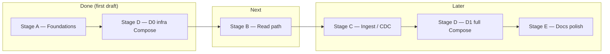

# Implementation guide — repository state and delivery flow

This document is the **operational counterpart** to [SEARCH FEATURE.md](../SEARCH%20FEATURE.md) (architecture) and [SEARCH_DEMO_AND_README_IMPLEMENTATION_PLAN.md](../SEARCH_DEMO_AND_README_IMPLEMENTATION_PLAN.md) (stages, effort, backlog). It records **where the code is now**, **what to do next**, and how the **first-draft ecosystem** fits together.

---

## 1. You are here (current step)

| Field | Value |
|-------|--------|
| **Stage** | **End of Stage A (foundations)** — **next work is Stage B** |
| **Layer** | **Layer 1 complete** for day-to-day dev; **Layer 2 (read path) not started** |
| **Plan reference** | [SEARCH_DEMO_AND_README_IMPLEMENTATION_PLAN.md](../SEARCH_DEMO_AND_README_IMPLEMENTATION_PLAN.md) — **section 4 (Stage B)**, **section 8 (Milestone M1)** |
| **Backlog** | Same document **section 10** — next rows: **5 (B.1–B.3)** after optional tidy-up of **A.4** (Kafka listener stub — see **section 4** below) |

**Done in repo (first draft ecosystem):**

- Multi-module Maven parent (**Java 21**, **Spring Boot 3.4**): `shared-contracts`, `inventory-api-service`, `search-query-service`, `search-indexer-service`
- JSON Schemas + contract tests (`shared-contracts`)
- Per-service health + `/api/v1/meta/info` smoke surface
- Testcontainers: Elasticsearch + PostgreSQL (run when Docker is available)
- **D0** early: `compose/docker-compose.infra.yml` (Postgres `wal_level=logical`, Elasticsearch, Redis)
- `scripts/onboard.sh`, `scripts/validate-infra.sh`, Maven Wrapper, GitHub Actions `mvn verify`

**Explicit gap vs plan Stage A:** **A.4** called for a **Kafka listener stub** in `search-indexer-service`; the service is a **skeleton only** (no `spring-kafka` yet). Either add a **disabled / no-op `@KafkaListener`** in a small follow-up, or introduce the listener when **C.5** starts — both are acceptable; track the chosen option in your PR.

---

## 2. Delivery flow (stages and layers)



| Phase | Layer | Stage IDs | Status |
|-------|--------|-----------|--------|
| Foundations | 1 | A.1–A.6 | **A.1–A.3, A.5, A.6 done**; **A.4** skeleton only (listener stub optional now or at C.5) |
| Read path | 2 | B.1–B.4 | **Next** — ES mapping, seed, query API |
| Ingest path | 3 | C.1–C.6 | Not started |
| Packaged demo | 4 | D1–D.4 (+ D5–D6 optional) | D0 done; D1+ after C |
| README / UX | 5 | E.1–E.4 | Partially done in README + `compose/README.md`; refresh after D1 |

---

## 3. First-draft ecosystem (what exists vs planned)

### 3.1 Runtime components

| Component | In repo now | Planned (architecture) |
|-----------|-------------|-------------------------|
| **inventory-api-service** | HTTP + actuator on **:8080** | JPA + Flyway + transactional outbox (SEARCH FEATURE.md **section 6**) |
| **search-query-service** | HTTP + actuator on **:8081** | Elasticsearch query API (SEARCH FEATURE.md **section 4**) |
| **search-indexer-service** | HTTP + actuator on **:8082** | Kafka consumer → bulk index + DLQ (SEARCH FEATURE.md **section 7.2**) |
| **PostgreSQL** | Compose D0 + Testcontainers | Same; Debezium source |
| **Elasticsearch** | Compose D0 + Testcontainers | Search index |
| **Redis** | Compose D0 | Optional query cache (SEARCH FEATURE.md **section 9**) |
| **Kafka / Connect / Debezium** | Not in Compose yet | **D1** + SEARCH FEATURE.md **section 19.1** |
| **API Gateway** | Not in v1 demo | Optional (implementation plan **section 3**) |
| **Observability** | Not wired | OTel + Prometheus/Grafana optional in demo (SEARCH FEATURE.md **sections 18, 19.1**) |

### 3.2 Data and contracts

| Artifact | Location |
|----------|----------|
| Index command schema (enriched) | `shared-contracts/.../index-item-enriched.schema.json` |
| Unwrapped outbox payload schema | `shared-contracts/.../outbox-payload-unwrapped.schema.json` |
| JSON fixtures + tests | `shared-contracts/src/test/...` |

Topic names and Debezium connector JSON will be added with **Stage C / D1**; keep them aligned with these schemas.

### 3.3 Ports and profiles

| Service | Port | Docker profile config |
|---------|------|------------------------|
| inventory-api-service | 8080 | `application-docker.yml` → JDBC `postgres:5432` (active once JPA lands) |
| search-query-service | 8081 | `application-docker.yml` → `elasticsearch:9200` |
| search-indexer-service | 8082 | `application-docker.yml` → `kafka:9092`, `elasticsearch:9200` |

Use `-Dspring-boot.run.profiles=docker` when running against Compose D0 (Kafka will fail for indexer until D1 — run indexer on default profile until then, or add `kafka` only in D1).

---

## 4. Next steps (execution order)

1. **Stage B.1** — Define Elasticsearch index mapping + settings (multi-tenant `tenant_id`, text fields per **SEARCH FEATURE.md section 4.1**).
2. **Stage B.2** — Seed data (test `_bulk` or `@BeforeAll` in integration test).
3. **Stage B.3** — Implement search endpoint (query string + filters → ES client / Spring Data Elasticsearch).
4. **Optional** — **A.4** completion: add `spring-kafka` + no-op or `@Profile` Kafka listener in indexer for early wiring tests.
5. **Stage B.4** — Redis query cache (after B.3 stable).
6. Then **Stage C** (outbox, Debezium, indexer consumer, DLQ) per plan **section 4** and **section 10** rows 7–8.

**Human review gates (from plan section 10):** after **B.3** (query contract), after **C.6** (first E2E), after **D.4** (demo UX).

---

## 5. Validation commands

```bash
./scripts/onboard.sh          # or: ./mvnw -B verify
docker compose -f compose/docker-compose.infra.yml up -d
./scripts/validate-infra.sh
```

---

## 6. Document map

| Document | Use when you need |
|----------|-------------------|
| [README.md](../README.md) | Onboarding, quickstart, repo layout |
| **This file** | **Current step**, next steps, ecosystem inventory |
| [SEARCH_DEMO_AND_README_IMPLEMENTATION_PLAN.md](../SEARCH_DEMO_AND_README_IMPLEMENTATION_PLAN.md) | Stages A–E, effort (pd), checklist section 9, backlog section 10 |
| [SEARCH FEATURE.md](../SEARCH%20FEATURE.md) | Full architecture, CDC depth, observability, cloud maps |
| [compose/README.md](../compose/README.md) | D0 Compose only |

---

## 7. Document control

| Version | Date | Summary |
|---------|------|---------|
| 1.0 | 2025-03-27 | First draft: flow, current step (post-A / pre-B), ecosystem table, next steps. |
